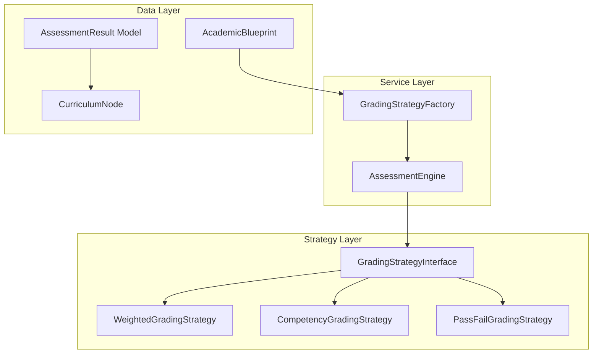

# Design Document: Assessment Engine

## Overview

The Assessment Engine calculates and stores student grades using configurable strategies defined in Academic Blueprints. It supports three grading types: weighted summative (Theology), competency-based (TVET), and pass/fail. The engine uses the Strategy pattern to swap grading algorithms based on blueprint configuration.

## Architecture



## Components and Interfaces

### 1. GradingStrategyInterface

```php
namespace App\Contracts;

interface GradingStrategyInterface
{
    /**
     * Calculate the final result from component scores
     */
    public function calculate(array $componentScores, array $config): AssessmentResultData;
    
    /**
     * Validate that component scores match expected components
     */
    public function validateComponents(array $componentScores, array $config): bool;
    
    /**
     * Get the result status (Pass, Fail, Competent, etc.)
     */
    public function getStatus(float $total, array $config): string;
}
```

### 2. WeightedGradingStrategy

```php
namespace App\Services\Grading;

class WeightedGradingStrategy implements GradingStrategyInterface
{
    public function calculate(array $componentScores, array $config): AssessmentResultData
    {
        // Multiply each score by weight, sum products
        // Calculate letter grade from boundaries
        // Return total, status, letter_grade
    }
    
    public function getStatus(float $total, array $config): string
    {
        return $total >= ($config['pass_mark'] ?? 40) ? 'Pass' : 'Referral';
    }
    
    public function getLetterGrade(float $total, array $boundaries): string;
}
```

### 3. CompetencyGradingStrategy

```php
namespace App\Services\Grading;

class CompetencyGradingStrategy implements GradingStrategyInterface
{
    public function calculate(array $componentScores, array $config): AssessmentResultData
    {
        // Check all required evidences are present/pass
        // Return status using custom labels if defined
    }
    
    public function getStatus(float $total, array $config): string
    {
        $labels = $config['competency_labels'] ?? ['pass' => 'Competent', 'fail' => 'Not Yet Competent'];
        return $total === 1.0 ? $labels['pass'] : $labels['fail'];
    }
}
```

### 4. GradingStrategyFactory

```php
namespace App\Services\Grading;

class GradingStrategyFactory
{
    public function createFromBlueprint(AcademicBlueprint $blueprint): GradingStrategyInterface
    {
        return match($blueprint->grading_logic['type']) {
            'weighted' => new WeightedGradingStrategy(),
            'competency' => new CompetencyGradingStrategy(),
            'pass_fail' => new PassFailGradingStrategy(),
            default => throw new InvalidGradingTypeException(),
        };
    }
}
```

### 5. AssessmentEngine

```php
namespace App\Services;

class AssessmentEngine
{
    public function __construct(
        private GradingStrategyFactory $strategyFactory
    ) {}
    
    public function calculateResult(
        Enrollment $enrollment,
        CurriculumNode $node,
        array $componentScores
    ): AssessmentResult;
    
    public function saveResult(AssessmentResult $result): AssessmentResult;
    
    public function publishResult(AssessmentResult $result): void;
    
    public function bulkPublish(CurriculumNode $node): int;
    
    public function getStudentResults(User $student, ?bool $publishedOnly = true): Collection;
}
```

### 6. AssessmentResult Model

```php
namespace App\Models;

class AssessmentResult extends Model
{
    protected $fillable = [
        'enrollment_id',
        'node_id',
        'result_data',
        'lecturer_comments',
        'is_published',
        'published_at',
        'graded_by_user_id',
    ];

    protected $casts = [
        'result_data' => 'array',
        'is_published' => 'boolean',
        'published_at' => 'datetime',
    ];

    public function enrollment(): BelongsTo;
    public function node(): BelongsTo;
    public function gradedBy(): BelongsTo;
    
    public function getTotal(): ?float;
    public function getStatus(): string;
    public function getLetterGrade(): ?string;
}
```

## Data Models

### Database Schema

```sql
CREATE TABLE assessment_results (
    id BIGINT UNSIGNED AUTO_INCREMENT PRIMARY KEY,
    enrollment_id BIGINT UNSIGNED NOT NULL,
    node_id BIGINT UNSIGNED NOT NULL,
    result_data JSON NOT NULL,
    lecturer_comments TEXT NULL,
    is_published BOOLEAN DEFAULT FALSE,
    published_at TIMESTAMP NULL,
    graded_by_user_id BIGINT UNSIGNED NULL,
    created_at TIMESTAMP DEFAULT CURRENT_TIMESTAMP,
    updated_at TIMESTAMP DEFAULT CURRENT_TIMESTAMP ON UPDATE CURRENT_TIMESTAMP,
    
    FOREIGN KEY (enrollment_id) REFERENCES enrollments(id) ON DELETE CASCADE,
    FOREIGN KEY (node_id) REFERENCES curriculum_nodes(id) ON DELETE CASCADE,
    FOREIGN KEY (graded_by_user_id) REFERENCES users(id) ON DELETE SET NULL,
    
    UNIQUE KEY unique_enrollment_node (enrollment_id, node_id),
    INDEX idx_node_published (node_id, is_published)
);
```

### JSON Schema: Result Data (Weighted)

```json
{
    "components": {
        "cat": 25,
        "exam": 60
    },
    "total": 51.5,
    "status": "Pass",
    "letter_grade": "C"
}
```

### JSON Schema: Result Data (Competency)

```json
{
    "evidences": {
        "practical_observation": "pass",
        "portfolio": "pass",
        "written_test": "pass"
    },
    "status": "Competent"
}
```

### JSON Schema: Grade Boundaries (in Blueprint)

```json
{
    "grade_boundaries": [
        { "grade": "A", "min": 70 },
        { "grade": "B", "min": 60 },
        { "grade": "C", "min": 50 },
        { "grade": "D", "min": 40 },
        { "grade": "F", "min": 0 }
    ]
}
```


## Correctness Properties

*A property is a characteristic or behavior that should hold true across all valid executions of a system-essentially, a formal statement about what the system should do. Properties serve as the bridge between human-readable specifications and machine-verifiable correctness guarantees.*

### Property 1: Weighted Calculation Correctness
*For any* set of component scores and weights where weights sum to 1.0, the calculated total SHALL equal the sum of (score × weight) for each component.
**Validates: Requirements 1.1, 3.1**

### Property 2: Competency All-Or-Nothing
*For any* set of required evidences, the status SHALL be "Competent" if and only if ALL evidences are marked "pass" or "present".
**Validates: Requirements 1.2, 4.2, 4.3**

### Property 3: Pass/Fail Threshold
*For any* score and pass_mark threshold, the status SHALL be "Pass" if score >= pass_mark, otherwise "Fail" or "Referral".
**Validates: Requirements 1.3, 3.2, 3.3**

### Property 4: Grading Config Validation
*For any* grading_logic missing required fields for its declared type, the Assessment Engine SHALL reject with a validation error.
**Validates: Requirements 1.4**

### Property 5: Result Persistence Integrity
*For any* assessment result saved with component scores, retrieving the result SHALL return identical component scores in result_data.
**Validates: Requirements 2.1, 2.4**

### Property 6: Upsert Behavior
*For any* enrollment-node combination, saving a result twice SHALL result in exactly one record with the latest data.
**Validates: Requirements 2.3**

### Property 7: Missing Component Treated as Zero
*For any* weighted calculation with a missing component score, the calculation SHALL treat the missing component as zero.
**Validates: Requirements 3.4**

### Property 8: Custom Competency Labels
*For any* blueprint with custom competency_labels, the result status SHALL use those custom labels instead of defaults.
**Validates: Requirements 4.4**

### Property 9: Grade Boundary Mapping
*For any* numeric score and grade_boundaries array, the letter grade SHALL be the grade with the highest min value that the score meets or exceeds.
**Validates: Requirements 5.1, 5.3**

### Property 10: Publish Workflow
*For any* newly created assessment result, is_published SHALL be false; after publishing, is_published SHALL be true with a non-null published_at timestamp.
**Validates: Requirements 6.1, 6.2**

### Property 11: Published Results Filter
*For any* student query, the returned results SHALL only include results where is_published is true.
**Validates: Requirements 6.3**

### Property 12: Bulk Publish
*For any* bulk publish operation on a node, all unpublished results for that node SHALL become published.
**Validates: Requirements 6.4**

### Property 13: Serialization Completeness
*For any* assessment result, serialization SHALL produce JSON containing all component scores, total, status, and letter_grade (if applicable).
**Validates: Requirements 7.1, 7.2**

## Error Handling

- **InvalidGradingTypeException**: Thrown when grading_logic type is not recognized
- **InvalidGradingConfigException**: Thrown when grading_logic is missing required fields
- **DuplicateResultException**: Should not occur due to upsert, but logged if constraint violation
- **UnpublishedResultAccessException**: Thrown if student tries to access unpublished result directly

## Testing Strategy

### Property-Based Testing Library
PHPUnit with eris/eris for property-based tests.

### Test Data Generators
```php
// Component scores generator
$scoresGen = Generator::associativeArray([
    'cat' => Generator::float(0, 100),
    'exam' => Generator::float(0, 100),
]);

// Weights generator (must sum to 1.0)
$weightsGen = Generator::bind(
    Generator::float(0, 1),
    fn($w) => ['cat' => $w, 'exam' => 1 - $w]
);

// Evidence set generator
$evidenceGen = Generator::associativeArray([
    'practical' => Generator::elements(['pass', 'fail']),
    'portfolio' => Generator::elements(['pass', 'fail']),
]);
```
