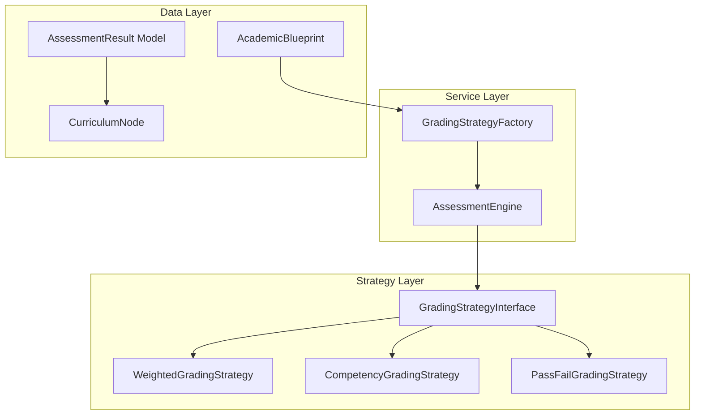

# Design Document: Assessment Engine

> **🔄 Migration Notice:** This spec is being migrated from PHP/Laravel to Python/Django. All code examples, models, and implementation details are written for Django. The original Laravel implementation exists in the codebase and will be replaced.

## Overview

The Assessment Engine calculates and stores student grades using configurable strategies defined in Academic Blueprints. It supports three grading types: weighted summative (Theology), competency-based (TVET), and pass/fail. The engine uses the Strategy pattern to swap grading algorithms based on blueprint configuration.

## Architecture



## Components and Interfaces

### 1. GradingStrategyInterface

```python
from abc import ABC, abstractmethod
from dataclasses import dataclass
from typing import Dict, Any, Optional

@dataclass
class AssessmentResultData:
    total: float
    status: str
    letter_grade: Optional[str] = None
    components: Dict[str, float] = None

class GradingStrategyInterface(ABC):
    @abstractmethod
    def calculate(self, component_scores: Dict[str, float], config: Dict[str, Any]) -> AssessmentResultData:
        """Calculate the final result from component scores"""
        pass

    @abstractmethod
    def validate_components(self, component_scores: Dict[str, float], config: Dict[str, Any]) -> bool:
        """Validate that component scores match expected components"""
        pass

    @abstractmethod
    def get_status(self, total: float, config: Dict[str, Any]) -> str:
        """Get the result status (Pass, Fail, Competent, etc.)"""
        pass
```

### 2. WeightedGradingStrategy

```python
class WeightedGradingStrategy(GradingStrategyInterface):
    def calculate(self, component_scores: Dict[str, float], config: Dict[str, Any]) -> AssessmentResultData:
        components = config.get('components', [])
        total = 0.0
        for comp in components:
            score = component_scores.get(comp['name'], 0)  # Missing = 0
            total += score * comp['weight']
        
        status = self.get_status(total, config)
        letter_grade = self.get_letter_grade(total, config.get('grade_boundaries', []))
        return AssessmentResultData(total=total, status=status, letter_grade=letter_grade, components=component_scores)

    def get_status(self, total: float, config: Dict[str, Any]) -> str:
        pass_mark = config.get('pass_mark', 40)
        return 'Pass' if total >= pass_mark else 'Referral'

    def get_letter_grade(self, total: float, boundaries: list) -> Optional[str]:
        for boundary in sorted(boundaries, key=lambda x: x['min'], reverse=True):
            if total >= boundary['min']:
                return boundary['grade']
        return 'F'

    def validate_components(self, component_scores: Dict[str, float], config: Dict[str, Any]) -> bool:
        return True
```


### 3. CompetencyGradingStrategy

```python
class CompetencyGradingStrategy(GradingStrategyInterface):
    def calculate(self, component_scores: Dict[str, float], config: Dict[str, Any]) -> AssessmentResultData:
        # All evidences must be 'pass' or 1.0
        all_pass = all(score in ['pass', 1, 1.0, True] for score in component_scores.values())
        total = 1.0 if all_pass else 0.0
        status = self.get_status(total, config)
        return AssessmentResultData(total=total, status=status, components=component_scores)

    def get_status(self, total: float, config: Dict[str, Any]) -> str:
        labels = config.get('competency_labels', {'pass': 'Competent', 'fail': 'Not Yet Competent'})
        return labels['pass'] if total == 1.0 else labels['fail']

    def validate_components(self, component_scores: Dict[str, float], config: Dict[str, Any]) -> bool:
        return True
```

### 4. GradingStrategyFactory

```python
class GradingStrategyFactory:
    def create_from_blueprint(self, blueprint) -> GradingStrategyInterface:
        grading_type = blueprint.grading_logic.get('type')
        if grading_type == 'weighted':
            return WeightedGradingStrategy()
        elif grading_type == 'competency':
            return CompetencyGradingStrategy()
        elif grading_type == 'pass_fail':
            return PassFailGradingStrategy()
        else:
            raise InvalidGradingTypeException(f"Unknown grading type: {grading_type}")
```

### 5. AssessmentEngine

```python
class AssessmentEngine:
    def __init__(self, strategy_factory: GradingStrategyFactory):
        self.strategy_factory = strategy_factory

    def calculate_result(self, enrollment, node, component_scores: Dict[str, float]) -> 'AssessmentResult':
        blueprint = enrollment.program.blueprint
        strategy = self.strategy_factory.create_from_blueprint(blueprint)
        result_data = strategy.calculate(component_scores, blueprint.grading_logic)
        return AssessmentResult(
            enrollment=enrollment,
            node=node,
            result_data=result_data.__dict__
        )

    def save_result(self, result: 'AssessmentResult') -> 'AssessmentResult':
        # Upsert: update if exists, create if not
        existing, created = AssessmentResult.objects.update_or_create(
            enrollment=result.enrollment,
            node=result.node,
            defaults={'result_data': result.result_data}
        )
        return existing

    def publish_result(self, result: 'AssessmentResult') -> None:
        result.is_published = True
        result.published_at = timezone.now()
        result.save()

    def bulk_publish(self, node) -> int:
        return AssessmentResult.objects.filter(node=node, is_published=False).update(
            is_published=True, published_at=timezone.now()
        )

    def get_student_results(self, student, published_only: bool = True):
        qs = AssessmentResult.objects.filter(enrollment__user=student)
        if published_only:
            qs = qs.filter(is_published=True)
        return qs
```

### 6. AssessmentResult Model

```python
from django.db import models
from django.utils import timezone

class AssessmentResult(models.Model):
    enrollment = models.ForeignKey('Enrollment', on_delete=models.CASCADE, related_name='assessment_results')
    node = models.ForeignKey('CurriculumNode', on_delete=models.CASCADE, related_name='assessment_results')
    result_data = models.JSONField()
    lecturer_comments = models.TextField(blank=True, null=True)
    is_published = models.BooleanField(default=False)
    published_at = models.DateTimeField(blank=True, null=True)
    graded_by = models.ForeignKey('User', on_delete=models.SET_NULL, null=True, related_name='graded_results')
    created_at = models.DateTimeField(auto_now_add=True)
    updated_at = models.DateTimeField(auto_now=True)

    class Meta:
        db_table = 'assessment_results'
        unique_together = ['enrollment', 'node']
        indexes = [models.Index(fields=['node', 'is_published'])]

    def get_total(self) -> float:
        return self.result_data.get('total')

    def get_status(self) -> str:
        return self.result_data.get('status')

    def get_letter_grade(self) -> str:
        return self.result_data.get('letter_grade')
```


## Data Models

### Database Schema

```sql
CREATE TABLE assessment_results (
    id BIGSERIAL PRIMARY KEY,
    enrollment_id BIGINT NOT NULL REFERENCES enrollments(id) ON DELETE CASCADE,
    node_id BIGINT NOT NULL REFERENCES curriculum_nodes(id) ON DELETE CASCADE,
    result_data JSONB NOT NULL,
    lecturer_comments TEXT NULL,
    is_published BOOLEAN DEFAULT FALSE,
    published_at TIMESTAMP NULL,
    graded_by_user_id BIGINT NULL REFERENCES users(id) ON DELETE SET NULL,
    created_at TIMESTAMP DEFAULT CURRENT_TIMESTAMP,
    updated_at TIMESTAMP DEFAULT CURRENT_TIMESTAMP,
    
    UNIQUE (enrollment_id, node_id)
);
CREATE INDEX idx_results_node_published ON assessment_results(node_id, is_published);
```

### JSON Schema: Result Data (Weighted)

```json
{
    "components": { "cat": 25, "exam": 60 },
    "total": 51.5,
    "status": "Pass",
    "letter_grade": "C"
}
```

### JSON Schema: Result Data (Competency)

```json
{
    "evidences": {
        "practical_observation": "pass",
        "portfolio": "pass",
        "written_test": "pass"
    },
    "status": "Competent"
}
```

## Correctness Properties

*A property is a characteristic or behavior that should hold true across all valid executions of a system-essentially, a formal statement about what the system should do. Properties serve as the bridge between human-readable specifications and machine-verifiable correctness guarantees.*

### Property 1: Weighted Calculation Correctness
*For any* set of component scores and weights where weights sum to 1.0, the calculated total SHALL equal the sum of (score × weight) for each component.
**Validates: Requirements 1.1, 3.1**

### Property 2: Competency All-Or-Nothing
*For any* set of required evidences, the status SHALL be "Competent" if and only if ALL evidences are marked "pass" or "present".
**Validates: Requirements 1.2, 4.2, 4.3**

### Property 3: Pass/Fail Threshold
*For any* score and pass_mark threshold, the status SHALL be "Pass" if score >= pass_mark, otherwise "Fail" or "Referral".
**Validates: Requirements 1.3, 3.2, 3.3**

### Property 4: Grading Config Validation
*For any* grading_logic missing required fields for its declared type, the Assessment Engine SHALL reject with a validation error.
**Validates: Requirements 1.4**

### Property 5: Result Persistence Integrity
*For any* assessment result saved with component scores, retrieving the result SHALL return identical component scores in result_data.
**Validates: Requirements 2.1, 2.4**

### Property 6: Upsert Behavior
*For any* enrollment-node combination, saving a result twice SHALL result in exactly one record with the latest data.
**Validates: Requirements 2.3**

### Property 7: Missing Component Treated as Zero
*For any* weighted calculation with a missing component score, the calculation SHALL treat the missing component as zero.
**Validates: Requirements 3.4**

### Property 8: Custom Competency Labels
*For any* blueprint with custom competency_labels, the result status SHALL use those custom labels instead of defaults.
**Validates: Requirements 4.4**

### Property 9: Grade Boundary Mapping
*For any* numeric score and grade_boundaries array, the letter grade SHALL be the grade with the highest min value that the score meets or exceeds.
**Validates: Requirements 5.1, 5.3**

### Property 10: Publish Workflow
*For any* newly created assessment result, is_published SHALL be false; after publishing, is_published SHALL be true with a non-null published_at timestamp.
**Validates: Requirements 6.1, 6.2**

### Property 11: Published Results Filter
*For any* student query, the returned results SHALL only include results where is_published is true.
**Validates: Requirements 6.3**

### Property 12: Bulk Publish
*For any* bulk publish operation on a node, all unpublished results for that node SHALL become published.
**Validates: Requirements 6.4**

### Property 13: Serialization Completeness
*For any* assessment result, serialization SHALL produce JSON containing all component scores, total, status, and letter_grade (if applicable).
**Validates: Requirements 7.1, 7.2**


## Error Handling

```python
class AssessmentEngineException(Exception):
    """Base exception for Assessment Engine"""
    pass

class InvalidGradingTypeException(AssessmentEngineException):
    """Thrown when grading_logic type is not recognized"""
    pass

class InvalidGradingConfigException(AssessmentEngineException):
    """Thrown when grading_logic is missing required fields"""
    pass
```

## Testing Strategy

### Property-Based Testing Library
We will use **Hypothesis** (Python property-based testing library) for property-based tests.

### Test Data Generators (Hypothesis Strategies)

```python
from hypothesis import strategies as st

# Component scores generator
scores_strategy = st.dictionaries(
    keys=st.sampled_from(['cat', 'exam', 'assignment']),
    values=st.floats(min_value=0, max_value=100)
)

# Weights generator (must sum to 1.0)
@st.composite
def weights_strategy(draw):
    w1 = draw(st.floats(min_value=0, max_value=1))
    return {'cat': w1, 'exam': 1 - w1}

# Evidence set generator
evidence_strategy = st.dictionaries(
    keys=st.sampled_from(['practical', 'portfolio', 'written']),
    values=st.sampled_from(['pass', 'fail'])
)
```
