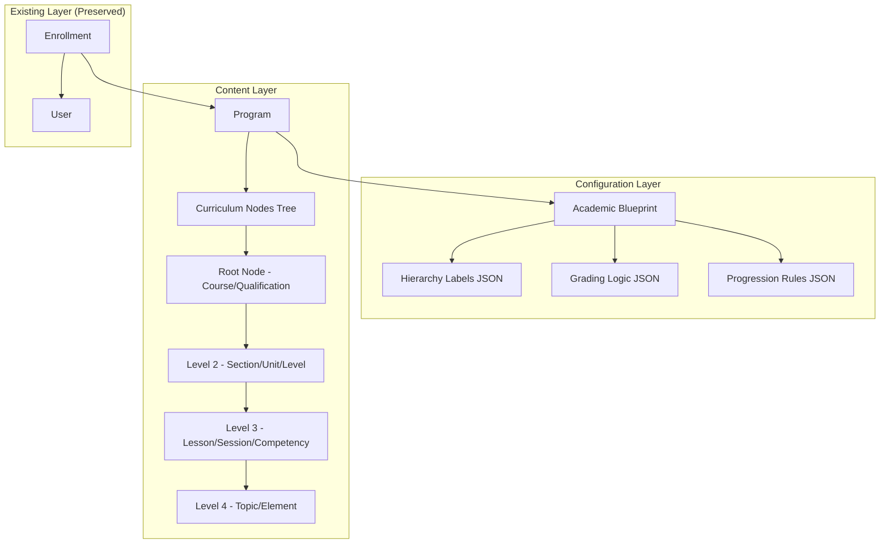

# Design Document: Blueprint Engine

> **🔄 Migration Notice:** This spec is being migrated from PHP/Laravel to Python/Django. All code examples, models, and implementation details are written for Django. The original Laravel implementation exists in the codebase and will be replaced.

## Overview

The Blueprint Engine transforms the LMS from a rigid Course → Section → Lesson hierarchy into a configurable, multi-tenant academic platform. This enables Crossview College to run Theology programs (Session-based), TVET programs (Competency-based), and future SaaS clients using the same codebase with different JSON configurations.

The engine introduces two core abstractions:
1. **Academic Blueprints** - Configuration objects defining hierarchy labels, grading logic, and progression rules
2. **Curriculum Nodes** - A recursive tree structure replacing the fixed Course/Section/Lesson models

## Architecture



## Components and Interfaces

### 1. AcademicBlueprint Model

```python
from django.db import models

class AcademicBlueprint(models.Model):
    name = models.CharField(max_length=100)
    description = models.TextField(blank=True, null=True)
    hierarchy_structure = models.JSONField()  # ["Year", "Unit", "Session"]
    grading_logic = models.JSONField()  # {"type": "weighted", "components": [...]}
    progression_rules = models.JSONField(blank=True, null=True)
    gamification_enabled = models.BooleanField(default=False)
    certificate_enabled = models.BooleanField(default=False)
    created_at = models.DateTimeField(auto_now_add=True)
    updated_at = models.DateTimeField(auto_now=True)
    deleted_at = models.DateTimeField(blank=True, null=True)

    class Meta:
        db_table = 'academic_blueprints'
        indexes = [models.Index(fields=['name'])]

    def get_hierarchy_depth(self) -> int:
        return len(self.hierarchy_structure)

    def get_label_for_depth(self, depth: int) -> str:
        if 0 <= depth < len(self.hierarchy_structure):
            return self.hierarchy_structure[depth]
        raise ValueError(f"Invalid depth {depth}")
```


### 2. CurriculumNode Model

```python
from django.db import models

class CurriculumNode(models.Model):
    program = models.ForeignKey('Program', on_delete=models.CASCADE, related_name='nodes')
    parent = models.ForeignKey('self', on_delete=models.CASCADE, null=True, blank=True, related_name='children')
    node_type = models.CharField(max_length=50)
    title = models.CharField(max_length=255)
    code = models.CharField(max_length=50, blank=True, null=True)
    description = models.TextField(blank=True, null=True)
    properties = models.JSONField(blank=True, null=True)  # {"pdf_url": "...", "video_url": "..."}
    completion_rules = models.JSONField(blank=True, null=True)  # {"requires_upload": true}
    position = models.PositiveIntegerField(default=0)
    is_published = models.BooleanField(default=False)
    created_at = models.DateTimeField(auto_now_add=True)
    updated_at = models.DateTimeField(auto_now=True)
    deleted_at = models.DateTimeField(blank=True, null=True)

    class Meta:
        db_table = 'curriculum_nodes'
        indexes = [
            models.Index(fields=['program', 'parent']),
            models.Index(fields=['node_type']),
            models.Index(fields=['position']),
        ]

    def get_depth(self) -> int:
        depth = 0
        node = self
        while node.parent:
            depth += 1
            node = node.parent
        return depth

    def get_label(self) -> str:
        blueprint = self.program.blueprint
        return blueprint.get_label_for_depth(self.get_depth())

    def get_ancestors(self):
        ancestors = []
        node = self.parent
        while node:
            ancestors.append(node)
            node = node.parent
        return list(reversed(ancestors))

    def get_descendants(self):
        descendants = []
        for child in self.children.all():
            descendants.append(child)
            descendants.extend(child.get_descendants())
        return descendants
```

### 3. CurriculumNodeRepository

```python
from django.db import connection
from typing import List, Optional

class CurriculumNodeRepository:
    def get_tree_for_program(self, program_id: int) -> List[CurriculumNode]:
        """Fetch entire tree using recursive CTE"""
        with connection.cursor() as cursor:
            cursor.execute("""
                WITH RECURSIVE tree AS (
                    SELECT * FROM curriculum_nodes WHERE program_id = %s AND parent_id IS NULL
                    UNION ALL
                    SELECT cn.* FROM curriculum_nodes cn
                    INNER JOIN tree t ON cn.parent_id = t.id
                )
                SELECT * FROM tree ORDER BY position
            """, [program_id])
            # Process results into CurriculumNode instances
            return self._rows_to_nodes(cursor.fetchall())

    def get_subtree(self, node_id: int) -> List[CurriculumNode]:
        """Fetch subtree from a specific node"""
        with connection.cursor() as cursor:
            cursor.execute("""
                WITH RECURSIVE subtree AS (
                    SELECT * FROM curriculum_nodes WHERE id = %s
                    UNION ALL
                    SELECT cn.* FROM curriculum_nodes cn
                    INNER JOIN subtree s ON cn.parent_id = s.id
                )
                SELECT * FROM subtree ORDER BY position
            """, [node_id])
            return self._rows_to_nodes(cursor.fetchall())

    def get_ancestors(self, node_id: int) -> List[CurriculumNode]:
        """Get ancestors (breadcrumb path)"""
        node = CurriculumNode.objects.get(id=node_id)
        return node.get_ancestors()

    def move_node(self, node_id: int, new_parent_id: Optional[int]) -> bool:
        """Move node to new parent with validation"""
        node = CurriculumNode.objects.get(id=node_id)
        # Validate depth won't exceed blueprint hierarchy
        new_depth = 0 if new_parent_id is None else CurriculumNode.objects.get(id=new_parent_id).get_depth() + 1
        max_depth = node.program.blueprint.get_hierarchy_depth() - 1
        if new_depth > max_depth:
            raise MaxDepthExceededException(f"Move would exceed max depth {max_depth}")
        node.parent_id = new_parent_id
        node.save()
        return True

    def reorder_siblings(self, node_ids: List[int]) -> None:
        """Reorder siblings by updating position field"""
        for position, node_id in enumerate(node_ids):
            CurriculumNode.objects.filter(id=node_id).update(position=position)
```


### 4. BlueprintValidationService

```python
from typing import List, Dict, Any
from .exceptions import InvalidHierarchyStructureException, InvalidGradingLogicException

class BlueprintValidationService:
    def validate_hierarchy_structure(self, structure: List[str]) -> bool:
        if not structure or not isinstance(structure, list):
            raise InvalidHierarchyStructureException("Hierarchy structure must be a non-empty list")
        for item in structure:
            if not isinstance(item, str) or not item.strip():
                raise InvalidHierarchyStructureException("All hierarchy items must be non-empty strings")
        return True

    def validate_grading_logic(self, logic: Dict[str, Any]) -> bool:
        if not logic or 'type' not in logic:
            raise InvalidGradingLogicException("Grading logic must have a 'type' field")
        
        grading_type = logic['type']
        if grading_type == 'weighted':
            if 'components' not in logic:
                raise InvalidGradingLogicException("Weighted grading requires 'components'")
        elif grading_type == 'competency':
            pass  # competency_labels optional
        elif grading_type == 'pass_fail':
            pass  # pass_mark optional with default
        else:
            raise InvalidGradingLogicException(f"Unknown grading type: {grading_type}")
        return True
```

### 5. BlueprintSerializationService

```python
import json
from typing import Dict, Any
from .models import AcademicBlueprint
from .exceptions import InvalidBlueprintJsonException

class BlueprintSerializationService:
    def serialize_to_json(self, blueprint: AcademicBlueprint) -> str:
        return json.dumps({
            'name': blueprint.name,
            'description': blueprint.description,
            'hierarchy_structure': blueprint.hierarchy_structure,
            'grading_logic': blueprint.grading_logic,
            'progression_rules': blueprint.progression_rules,
            'gamification_enabled': blueprint.gamification_enabled,
            'certificate_enabled': blueprint.certificate_enabled,
        })

    def deserialize_from_json(self, json_str: str) -> AcademicBlueprint:
        try:
            data = json.loads(json_str)
        except json.JSONDecodeError as e:
            raise InvalidBlueprintJsonException(f"Invalid JSON: {e}")
        
        required_fields = ['name', 'hierarchy_structure', 'grading_logic']
        for field in required_fields:
            if field not in data:
                raise InvalidBlueprintJsonException(f"Missing required field: {field}")
        
        return AcademicBlueprint(**data)
```

### 6. LegacyMigrationService

```python
from typing import Dict, List
from dataclasses import dataclass

@dataclass
class MigrationReport:
    courses_migrated: int = 0
    sections_migrated: int = 0
    lessons_migrated: int = 0
    errors: List[str] = None

class LegacyMigrationService:
    def create_default_theology_blueprint(self) -> AcademicBlueprint:
        return AcademicBlueprint.objects.create(
            name="Theology Standard",
            hierarchy_structure=["Course", "Section", "Lesson"],
            grading_logic={"type": "weighted", "pass_mark": 40, "components": [
                {"name": "CAT", "weight": 0.3},
                {"name": "Exam", "weight": 0.7}
            ]}
        )

    def migrate_courses_to_nodes(self) -> MigrationReport:
        """Convert Course records to root CurriculumNodes"""
        pass

    def migrate_sections_to_nodes(self) -> MigrationReport:
        """Convert CourseSection records to child nodes"""
        pass

    def migrate_lessons_to_nodes(self) -> MigrationReport:
        """Convert Lesson records to child nodes, preserving content"""
        pass

    def rollback_migration(self) -> None:
        """Rollback migration changes"""
        pass

    def generate_report(self) -> Dict:
        """Generate migration report"""
        pass
```


## Data Models

### Database Schema

```sql
-- Academic Blueprints Table
CREATE TABLE academic_blueprints (
    id BIGSERIAL PRIMARY KEY,
    name VARCHAR(100) NOT NULL,
    description TEXT NULL,
    hierarchy_structure JSONB NOT NULL,
    grading_logic JSONB NOT NULL,
    progression_rules JSONB NULL,
    gamification_enabled BOOLEAN DEFAULT FALSE,
    certificate_enabled BOOLEAN DEFAULT FALSE,
    created_at TIMESTAMP DEFAULT CURRENT_TIMESTAMP,
    updated_at TIMESTAMP DEFAULT CURRENT_TIMESTAMP,
    deleted_at TIMESTAMP NULL
);
CREATE INDEX idx_blueprints_name ON academic_blueprints(name);

-- Curriculum Nodes Table (Recursive Tree)
CREATE TABLE curriculum_nodes (
    id BIGSERIAL PRIMARY KEY,
    program_id BIGINT NOT NULL REFERENCES programs(id) ON DELETE CASCADE,
    parent_id BIGINT NULL REFERENCES curriculum_nodes(id) ON DELETE CASCADE,
    node_type VARCHAR(50) NOT NULL,
    title VARCHAR(255) NOT NULL,
    code VARCHAR(50) NULL,
    description TEXT NULL,
    properties JSONB NULL,
    completion_rules JSONB NULL,
    position INTEGER DEFAULT 0,
    is_published BOOLEAN DEFAULT FALSE,
    created_at TIMESTAMP DEFAULT CURRENT_TIMESTAMP,
    updated_at TIMESTAMP DEFAULT CURRENT_TIMESTAMP,
    deleted_at TIMESTAMP NULL
);
CREATE INDEX idx_nodes_program_parent ON curriculum_nodes(program_id, parent_id);
CREATE INDEX idx_nodes_type ON curriculum_nodes(node_type);
CREATE INDEX idx_nodes_position ON curriculum_nodes(position);

-- Programs Table (Modified to link to Blueprint)
ALTER TABLE programs ADD COLUMN blueprint_id BIGINT NULL REFERENCES academic_blueprints(id);
```

### JSON Schema: Hierarchy Structure

```json
{
    "$schema": "http://json-schema.org/draft-07/schema#",
    "type": "array",
    "minItems": 1,
    "items": { "type": "string", "minLength": 1 },
    "examples": [
        ["Year", "Unit", "Session"],
        ["Level", "Module", "Competency", "Element"]
    ]
}
```

### JSON Schema: Grading Logic

```json
{
    "$schema": "http://json-schema.org/draft-07/schema#",
    "type": "object",
    "required": ["type"],
    "properties": {
        "type": { "type": "string", "enum": ["weighted", "competency", "pass_fail"] },
        "pass_mark": { "type": "number", "minimum": 0, "maximum": 100 },
        "components": {
            "type": "array",
            "items": {
                "type": "object",
                "required": ["name", "weight"],
                "properties": {
                    "name": { "type": "string" },
                    "weight": { "type": "number", "minimum": 0, "maximum": 1 }
                }
            }
        }
    }
}
```

### JSON Schema: Node Properties

```json
{
    "$schema": "http://json-schema.org/draft-07/schema#",
    "type": "object",
    "properties": {
        "credit_hours": { "type": "number" },
        "duration_minutes": { "type": "integer" },
        "pdf_url": { "type": "string", "format": "uri" },
        "video_url": { "type": "string", "format": "uri" },
        "content_html": { "type": "string" },
        "attachments": { "type": "array" }
    }
}
```


## Correctness Properties

*A property is a characteristic or behavior that should hold true across all valid executions of a system-essentially, a formal statement about what the system should do. Properties serve as the bridge between human-readable specifications and machine-verifiable correctness guarantees.*

### Property 1: Blueprint Persistence Integrity
*For any* valid AcademicBlueprint with hierarchy_structure and grading_logic, saving to the database and retrieving should return an equivalent object with all JSON fields intact.
**Validates: Requirements 1.1, 1.2**

### Property 2: Blueprint Validation Rejects Invalid Configurations
*For any* blueprint with an empty hierarchy_structure array OR grading_logic missing required fields for its type, the Blueprint Engine should reject the save operation with a validation error.
**Validates: Requirements 1.3, 1.4**

### Property 3: Blueprint Deletion Protection
*For any* AcademicBlueprint that has one or more associated Programs, attempting to delete the blueprint should fail and return an error.
**Validates: Requirements 1.5**

### Property 4: Node Parent Reference Integrity
*For any* CurriculumNode created with a parent_id, the parent relationship should resolve to the correct parent node, and root nodes should have null parent_id.
**Validates: Requirements 2.1**

### Property 5: Node Type Validation Against Blueprint
*For any* CurriculumNode, the node_type must be one of the labels defined in the associated program's blueprint hierarchy_structure. Invalid node_types should be rejected.
**Validates: Requirements 2.2**

### Property 6: Recursive Tree Retrieval Completeness
*For any* program with a curriculum tree of N nodes, querying the tree should return exactly N nodes with correct parent-child relationships preserved.
**Validates: Requirements 2.3**

### Property 7: Cascade Delete Removes All Descendants
*For any* CurriculumNode with descendants, deleting the node should also delete all descendant nodes. The count of remaining nodes should equal original count minus the deleted subtree size.
**Validates: Requirements 2.4**

### Property 8: Node Move Depth Validation
*For any* CurriculumNode move operation, if the move would result in a tree depth exceeding the blueprint's hierarchy_structure length, the move should be rejected.
**Validates: Requirements 2.5**

### Property 9: Properties JSON Merge Behavior
*For any* CurriculumNode with existing properties, updating with new properties should merge (not replace), preserving keys not present in the update.
**Validates: Requirements 3.2**

### Property 10: Node Ordering Consistency
*For any* set of sibling CurriculumNodes, fetching them should return nodes ordered by their position field in ascending order.
**Validates: Requirements 5.2**

### Property 11: Migration Structure Preservation
*For any* existing Course with Sections and Lessons, after migration the total count of CurriculumNodes should equal (1 course + N sections + M lessons), and parent-child relationships should mirror the original structure.
**Validates: Requirements 6.2, 6.3, 6.4**

### Property 12: Migration Content Preservation
*For any* Lesson with content URLs (video_url, pdf attachments), after migration the corresponding CurriculumNode's properties JSON should contain equivalent content references.
**Validates: Requirements 6.5**

### Property 13: Blueprint Serialization Round-Trip
*For any* valid AcademicBlueprint, serializing to JSON and deserializing back should produce an equivalent Blueprint object.
**Validates: Requirements 7.1, 7.2**

### Property 14: Invalid JSON Deserialization Throws Exception
*For any* malformed or schema-invalid JSON string, deserializing should throw a validation exception with error details, not silently fail or create invalid objects.
**Validates: Requirements 7.3**


## Error Handling

### Custom Exceptions

```python
class BlueprintEngineException(Exception):
    """Base exception for Blueprint Engine"""
    pass

class InvalidHierarchyStructureException(BlueprintEngineException):
    """Thrown when hierarchy_structure is empty or contains non-string values"""
    pass

class InvalidGradingLogicException(BlueprintEngineException):
    """Thrown when grading_logic is missing required fields for its type"""
    pass

class InvalidNodeTypeException(BlueprintEngineException):
    """Thrown when node_type doesn't match blueprint hierarchy"""
    pass

class MaxDepthExceededException(BlueprintEngineException):
    """Thrown when node creation/move would exceed hierarchy depth"""
    pass

class BlueprintInUseException(BlueprintEngineException):
    """Thrown when attempting to delete a blueprint with associated programs"""
    pass

class OrphanedNodeException(BlueprintEngineException):
    """Thrown when a node's parent_id references a non-existent node"""
    pass

class InvalidBlueprintJsonException(BlueprintEngineException):
    """Thrown when JSON deserialization fails"""
    pass
```

## Testing Strategy

### Property-Based Testing Library
We will use **Hypothesis** (Python property-based testing library) for property-based tests.

Each property-based test will:
1. Run a minimum of 100 iterations with random inputs
2. Be tagged with a comment referencing the correctness property: `**Feature: blueprint-engine, Property {number}: {property_text}**`
3. Use strategies to create valid and invalid test data

### Unit Tests
Unit tests will cover:
- Individual model methods (get_hierarchy_depth, get_label_for_depth)
- Service method edge cases
- JSON schema validation
- Database constraint enforcement

### Integration Tests
Integration tests will cover:
- Full migration workflow
- API endpoints for CRUD operations
- Tree traversal with real database queries

### Test Data Generators (Hypothesis Strategies)

```python
from hypothesis import strategies as st

# Blueprint generator
blueprint_strategy = st.fixed_dictionaries({
    'name': st.text(min_size=1, max_size=100),
    'hierarchy_structure': st.lists(st.text(min_size=1, max_size=50), min_size=1, max_size=5),
    'grading_logic': st.one_of(
        st.fixed_dictionaries({'type': st.just('weighted'), 'pass_mark': st.integers(0, 100)}),
        st.fixed_dictionaries({'type': st.just('competency')}),
        st.fixed_dictionaries({'type': st.just('pass_fail')})
    )
})

# Curriculum tree generator
@st.composite
def tree_strategy(draw, max_depth=4):
    title = draw(st.text(min_size=1, max_size=100))
    if max_depth > 0:
        children = draw(st.lists(tree_strategy(max_depth=max_depth-1), max_size=3))
    else:
        children = []
    return {'title': title, 'children': children}
```
