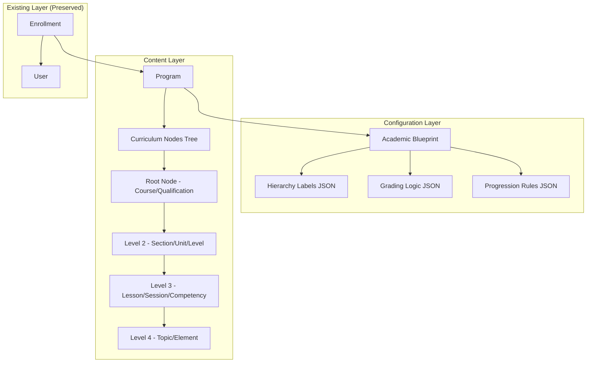

# Design Document: Blueprint Engine

## Overview

The Blueprint Engine transforms the LMS from a rigid Course → Section → Lesson hierarchy into a configurable, multi-tenant academic platform. This enables Crossview College to run Theology programs (Session-based), TVET programs (Competency-based), and future SaaS clients using the same codebase with different JSON configurations.

The engine introduces two core abstractions:
1. **Academic Blueprints** - Configuration objects defining hierarchy labels, grading logic, and progression rules
2. **Curriculum Nodes** - A recursive tree structure replacing the fixed Course/Section/Lesson models

## Architecture



## Components and Interfaces

### 1. AcademicBlueprint Model

```php
namespace App\Models;

class AcademicBlueprint extends Model
{
    protected $fillable = [
        'name',
        'description',
        'hierarchy_structure',  // JSON: ["Year", "Unit", "Session"]
        'grading_logic',        // JSON: {"type": "weighted", "components": [...]}
        'progression_rules',    // JSON: {"sequential": true, "prerequisites": [...]}
        'gamification_enabled',
        'certificate_enabled',
    ];

    protected $casts = [
        'hierarchy_structure' => 'array',
        'grading_logic' => 'array',
        'progression_rules' => 'array',
        'gamification_enabled' => 'boolean',
        'certificate_enabled' => 'boolean',
    ];

    public function programs(): HasMany;
    public function getHierarchyDepth(): int;
    public function getLabelForDepth(int $depth): string;
    public function getGradingStrategy(): GradingStrategyInterface;
}
```

### 2. CurriculumNode Model

```php
namespace App\Models;

class CurriculumNode extends Model
{
    protected $fillable = [
        'program_id',
        'parent_id',
        'node_type',
        'title',
        'code',
        'description',
        'properties',       // JSON: {"pdf_url": "...", "video_url": "...", "credit_hours": 3}
        'completion_rules', // JSON: {"requires_upload": true, "min_score": 40}
        'position',
        'is_published',
    ];

    protected $casts = [
        'properties' => 'array',
        'completion_rules' => 'array',
        'position' => 'integer',
        'is_published' => 'boolean',
    ];

    public function program(): BelongsTo;
    public function parent(): BelongsTo;
    public function children(): HasMany;
    public function ancestors(): Collection;
    public function descendants(): Collection;
    public function getDepth(): int;
    public function getLabel(): string;  // Returns label from blueprint based on depth
}
```

### 3. CurriculumNodeRepository

```php
namespace App\Repositories;

class CurriculumNodeRepository
{
    /**
     * Fetch entire tree using recursive CTE
     */
    public function getTreeForProgram(int $programId): Collection;
    
    /**
     * Fetch subtree from a specific node
     */
    public function getSubtree(int $nodeId): Collection;
    
    /**
     * Get ancestors (breadcrumb path)
     */
    public function getAncestors(int $nodeId): Collection;
    
    /**
     * Move node to new parent with validation
     */
    public function moveNode(int $nodeId, ?int $newParentId): bool;
    
    /**
     * Reorder siblings
     */
    public function reorderSiblings(array $nodeIds): void;
}
```

### 4. BlueprintService

```php
namespace App\Services;

class BlueprintService
{
    public function validateHierarchyStructure(array $structure): bool;
    public function validateGradingLogic(array $logic): bool;
    public function createDefaultTheologyBlueprint(): AcademicBlueprint;
    public function createDefaultTVETBlueprint(): AcademicBlueprint;
    public function serializeToJson(AcademicBlueprint $blueprint): string;
    public function deserializeFromJson(string $json): AcademicBlueprint;
}
```

### 5. MigrationService

```php
namespace App\Services;

class LegacyMigrationService
{
    public function migrateCoursesToNodes(): MigrationReport;
    public function migrateSectionsToNodes(): MigrationReport;
    public function migrateLessonsToNodes(): MigrationReport;
    public function rollbackMigration(): void;
    public function generateReport(): array;
}
```

## Data Models

### Database Schema

```sql
-- Academic Blueprints Table
CREATE TABLE academic_blueprints (
    id BIGINT UNSIGNED AUTO_INCREMENT PRIMARY KEY,
    name VARCHAR(100) NOT NULL,
    description TEXT NULL,
    hierarchy_structure JSON NOT NULL,
    grading_logic JSON NOT NULL,
    progression_rules JSON NULL,
    gamification_enabled BOOLEAN DEFAULT FALSE,
    certificate_enabled BOOLEAN DEFAULT FALSE,
    created_at TIMESTAMP DEFAULT CURRENT_TIMESTAMP,
    updated_at TIMESTAMP DEFAULT CURRENT_TIMESTAMP ON UPDATE CURRENT_TIMESTAMP,
    deleted_at TIMESTAMP NULL,
    
    INDEX idx_name (name)
);

-- Curriculum Nodes Table (Recursive Tree)
CREATE TABLE curriculum_nodes (
    id BIGINT UNSIGNED AUTO_INCREMENT PRIMARY KEY,
    program_id BIGINT UNSIGNED NOT NULL,
    parent_id BIGINT UNSIGNED NULL,
    node_type VARCHAR(50) NOT NULL,
    title VARCHAR(255) NOT NULL,
    code VARCHAR(50) NULL,
    description TEXT NULL,
    properties JSON NULL,
    completion_rules JSON NULL,
    position INT UNSIGNED DEFAULT 0,
    is_published BOOLEAN DEFAULT FALSE,
    created_at TIMESTAMP DEFAULT CURRENT_TIMESTAMP,
    updated_at TIMESTAMP DEFAULT CURRENT_TIMESTAMP ON UPDATE CURRENT_TIMESTAMP,
    deleted_at TIMESTAMP NULL,
    
    FOREIGN KEY (program_id) REFERENCES programs(id) ON DELETE CASCADE,
    FOREIGN KEY (parent_id) REFERENCES curriculum_nodes(id) ON DELETE CASCADE,
    
    INDEX idx_program_parent (program_id, parent_id),
    INDEX idx_node_type (node_type),
    INDEX idx_position (position)
);

-- Programs Table (Modified to link to Blueprint)
ALTER TABLE programs ADD COLUMN blueprint_id BIGINT UNSIGNED NULL;
ALTER TABLE programs ADD FOREIGN KEY (blueprint_id) REFERENCES academic_blueprints(id);
```

### JSON Schema: Hierarchy Structure

```json
{
    "$schema": "http://json-schema.org/draft-07/schema#",
    "type": "array",
    "minItems": 1,
    "items": {
        "type": "string",
        "minLength": 1
    },
    "examples": [
        ["Year", "Unit", "Session"],
        ["Level", "Module", "Competency", "Element"],
        ["Track", "Course", "Lesson"]
    ]
}
```

### JSON Schema: Grading Logic

```json
{
    "$schema": "http://json-schema.org/draft-07/schema#",
    "type": "object",
    "required": ["type"],
    "properties": {
        "type": {
            "type": "string",
            "enum": ["weighted", "competency", "pass_fail"]
        },
        "pass_mark": {
            "type": "number",
            "minimum": 0,
            "maximum": 100
        },
        "components": {
            "type": "array",
            "items": {
                "type": "object",
                "required": ["name", "weight"],
                "properties": {
                    "name": { "type": "string" },
                    "weight": { "type": "number", "minimum": 0, "maximum": 1 }
                }
            }
        },
        "competency_labels": {
            "type": "object",
            "properties": {
                "pass": { "type": "string" },
                "fail": { "type": "string" }
            }
        }
    },
    "examples": [
        {
            "type": "weighted",
            "pass_mark": 40,
            "components": [
                { "name": "CAT", "weight": 0.3 },
                { "name": "Exam", "weight": 0.7 }
            ]
        },
        {
            "type": "competency",
            "competency_labels": {
                "pass": "Competent",
                "fail": "Not Yet Competent"
            }
        }
    ]
}
```

### JSON Schema: Node Properties

```json
{
    "$schema": "http://json-schema.org/draft-07/schema#",
    "type": "object",
    "properties": {
        "credit_hours": { "type": "number" },
        "duration_minutes": { "type": "integer" },
        "pdf_url": { "type": "string", "format": "uri" },
        "video_url": { "type": "string", "format": "uri" },
        "audio_url": { "type": "string", "format": "uri" },
        "content_html": { "type": "string" },
        "attachments": {
            "type": "array",
            "items": {
                "type": "object",
                "properties": {
                    "name": { "type": "string" },
                    "url": { "type": "string", "format": "uri" },
                    "type": { "type": "string" }
                }
            }
        }
    }
}
```


## Correctness Properties

*A property is a characteristic or behavior that should hold true across all valid executions of a system-essentially, a formal statement about what the system should do. Properties serve as the bridge between human-readable specifications and machine-verifiable correctness guarantees.*

### Property 1: Blueprint Persistence Integrity
*For any* valid AcademicBlueprint with hierarchy_structure and grading_logic, saving to the database and retrieving should return an equivalent object with all JSON fields intact.
**Validates: Requirements 1.1, 1.2**

### Property 2: Blueprint Validation Rejects Invalid Configurations
*For any* blueprint with an empty hierarchy_structure array OR grading_logic missing required fields for its type, the Blueprint Engine should reject the save operation with a validation error.
**Validates: Requirements 1.3, 1.4**

### Property 3: Blueprint Deletion Protection
*For any* AcademicBlueprint that has one or more associated Programs, attempting to delete the blueprint should fail and return an error.
**Validates: Requirements 1.5**

### Property 4: Node Parent Reference Integrity
*For any* CurriculumNode created with a parent_id, the parent relationship should resolve to the correct parent node, and root nodes should have null parent_id.
**Validates: Requirements 2.1**

### Property 5: Node Type Validation Against Blueprint
*For any* CurriculumNode, the node_type must be one of the labels defined in the associated program's blueprint hierarchy_structure. Invalid node_types should be rejected.
**Validates: Requirements 2.2**

### Property 6: Recursive Tree Retrieval Completeness
*For any* program with a curriculum tree of N nodes, querying the tree should return exactly N nodes with correct parent-child relationships preserved.
**Validates: Requirements 2.3**

### Property 7: Cascade Delete Removes All Descendants
*For any* CurriculumNode with descendants, deleting the node should also delete all descendant nodes. The count of remaining nodes should equal original count minus the deleted subtree size.
**Validates: Requirements 2.4**

### Property 8: Node Move Depth Validation
*For any* CurriculumNode move operation, if the move would result in a tree depth exceeding the blueprint's hierarchy_structure length, the move should be rejected.
**Validates: Requirements 2.5**

### Property 9: Properties JSON Merge Behavior
*For any* CurriculumNode with existing properties, updating with new properties should merge (not replace), preserving keys not present in the update.
**Validates: Requirements 3.2**

### Property 10: Node Ordering Consistency
*For any* set of sibling CurriculumNodes, fetching them should return nodes ordered by their position field in ascending order.
**Validates: Requirements 5.2**

### Property 11: Migration Structure Preservation
*For any* existing Course with Sections and Lessons, after migration the total count of CurriculumNodes should equal (1 course + N sections + M lessons), and parent-child relationships should mirror the original structure.
**Validates: Requirements 6.2, 6.3, 6.4**

### Property 12: Migration Content Preservation
*For any* Lesson with content URLs (video_url, pdf attachments), after migration the corresponding CurriculumNode's properties JSON should contain equivalent content references.
**Validates: Requirements 6.5**

### Property 13: Blueprint Serialization Round-Trip
*For any* valid AcademicBlueprint, serializing to JSON and deserializing back should produce an equivalent Blueprint object.
**Validates: Requirements 7.1, 7.2**

### Property 14: Invalid JSON Deserialization Throws Exception
*For any* malformed or schema-invalid JSON string, deserializing should throw a validation exception with error details, not silently fail or create invalid objects.
**Validates: Requirements 7.3**

## Error Handling

### Validation Errors
- **InvalidHierarchyStructureException**: Thrown when hierarchy_structure is empty or contains non-string values
- **InvalidGradingLogicException**: Thrown when grading_logic is missing required fields for its type
- **InvalidNodeTypeException**: Thrown when node_type doesn't match blueprint hierarchy
- **MaxDepthExceededException**: Thrown when node creation/move would exceed hierarchy depth

### Database Errors
- **BlueprintInUseException**: Thrown when attempting to delete a blueprint with associated programs
- **OrphanedNodeException**: Thrown when a node's parent_id references a non-existent node
- **CircularReferenceException**: Thrown when a node move would create a circular parent reference

### Migration Errors
- **MigrationDataIntegrityException**: Thrown when source data is inconsistent
- **MigrationRollbackException**: Thrown when rollback fails

## Testing Strategy

### Property-Based Testing Library
We will use **PHPUnit** with **eris/eris** (PHP property-based testing library) for property-based tests.

Each property-based test will:
1. Run a minimum of 100 iterations with random inputs
2. Be tagged with a comment referencing the correctness property: `**Feature: blueprint-engine, Property {number}: {property_text}**`
3. Use generators to create valid and invalid test data

### Unit Tests
Unit tests will cover:
- Individual model methods (getHierarchyDepth, getLabelForDepth)
- Service method edge cases
- JSON schema validation
- Database constraint enforcement

### Integration Tests
Integration tests will cover:
- Full migration workflow
- API endpoints for CRUD operations
- Tree traversal with real database queries

### Test Data Generators
```php
// Blueprint generator
$blueprintGen = Generator::tuple(
    Generator::nonEmptyArrayOf(Generator::string()),  // hierarchy_structure
    Generator::oneOf([
        ['type' => 'weighted', 'pass_mark' => Generator::int(0, 100)],
        ['type' => 'competency'],
        ['type' => 'pass_fail']
    ])
);

// Curriculum tree generator
$treeGen = Generator::recursive(
    fn($self) => Generator::tuple(
        Generator::string(),  // title
        Generator::arrayOf($self)  // children
    ),
    maxDepth: 4
);
```
