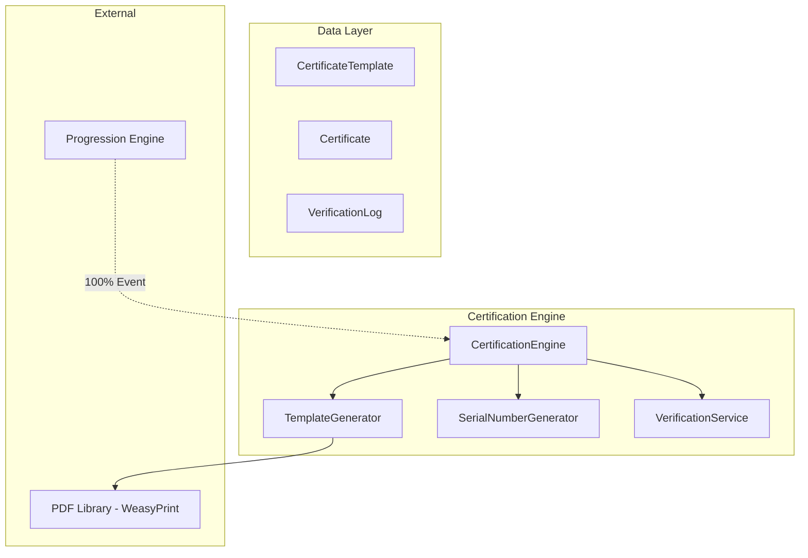

# Design Document: Certification Engine

> **🔄 Migration Notice:** This spec is being migrated from PHP/Laravel to Python/Django. All code examples, models, and implementation details are written for Django. The original Laravel implementation exists in the codebase and will be replaced.

## Overview

The Certification Engine generates PDF certificates when students complete programs. It listens for 100% completion events from the Progression Engine, populates certificate templates with student data, generates unique serial numbers, and provides verification endpoints.

## Architecture



## Components and Interfaces

### 1. CertificateTemplate Model

```python
from django.db import models

class CertificateTemplate(models.Model):
    name = models.CharField(max_length=255)
    blueprint = models.ForeignKey('AcademicBlueprint', on_delete=models.SET_NULL, null=True, related_name='templates')
    template_html = models.TextField()
    is_default = models.BooleanField(default=False)
    metadata = models.JSONField(blank=True, null=True)
    created_at = models.DateTimeField(auto_now_add=True)
    updated_at = models.DateTimeField(auto_now=True)

    class Meta:
        db_table = 'certificate_templates'
        indexes = [
            models.Index(fields=['blueprint']),
            models.Index(fields=['is_default']),
        ]

    def has_required_placeholders(self) -> bool:
        required = ['{{student_name}}', '{{program_title}}', '{{completion_date}}', '{{serial_number}}']
        return all(p in self.template_html for p in required)
```

### 2. Certificate Model

```python
class Certificate(models.Model):
    enrollment = models.ForeignKey('Enrollment', on_delete=models.CASCADE, related_name='certificates')
    template = models.ForeignKey('CertificateTemplate', on_delete=models.PROTECT)
    serial_number = models.CharField(max_length=50, unique=True)
    student_name = models.CharField(max_length=255)
    program_title = models.CharField(max_length=255)
    completion_date = models.DateField()
    issue_date = models.DateField()
    pdf_path = models.CharField(max_length=500)
    is_revoked = models.BooleanField(default=False)
    revoked_at = models.DateTimeField(blank=True, null=True)
    revocation_reason = models.TextField(blank=True, null=True)
    metadata = models.JSONField(blank=True, null=True)
    created_at = models.DateTimeField(auto_now_add=True)

    class Meta:
        db_table = 'certificates'
        indexes = [
            models.Index(fields=['serial_number']),
            models.Index(fields=['enrollment']),
        ]

    def get_signed_download_url(self) -> str:
        from django.core.signing import TimestampSigner
        signer = TimestampSigner()
        return signer.sign(self.pdf_path)

    def get_verification_url(self) -> str:
        from django.urls import reverse
        return reverse('certificate-verify', kwargs={'serial': self.serial_number})
```


### 3. VerificationLog Model

```python
class VerificationLog(models.Model):
    certificate = models.ForeignKey('Certificate', on_delete=models.SET_NULL, null=True, related_name='verification_logs')
    serial_number_queried = models.CharField(max_length=50)
    ip_address = models.GenericIPAddressField(blank=True, null=True)
    user_agent = models.TextField(blank=True, null=True)
    result = models.CharField(max_length=20, choices=[('valid', 'Valid'), ('revoked', 'Revoked'), ('not_found', 'Not Found')])
    verified_at = models.DateTimeField()
    created_at = models.DateTimeField(auto_now_add=True)

    class Meta:
        db_table = 'verification_logs'
        indexes = [
            models.Index(fields=['serial_number_queried']),
            models.Index(fields=['verified_at']),
        ]
```

### 4. CertificationEngine Service

```python
from django.utils import timezone
from typing import Optional

class CertificationEngine:
    def __init__(self, template_generator, serial_generator, verification_service):
        self.template_generator = template_generator
        self.serial_generator = serial_generator
        self.verification_service = verification_service

    def generate_certificate(self, enrollment) -> Certificate:
        template = self.template_generator.get_template_for_enrollment(enrollment)
        serial = self.serial_generator.generate()
        
        data = {
            'student_name': enrollment.user.get_full_name(),
            'program_title': enrollment.program.title,
            'completion_date': timezone.now().date(),
            'serial_number': serial,
        }
        
        pdf_path = self.template_generator.generate(template, data)
        
        return Certificate.objects.create(
            enrollment=enrollment,
            template=template,
            serial_number=serial,
            student_name=data['student_name'],
            program_title=data['program_title'],
            completion_date=data['completion_date'],
            issue_date=timezone.now().date(),
            pdf_path=pdf_path,
        )

    def on_program_completed(self, enrollment) -> None:
        if enrollment.program.blueprint.certificate_enabled:
            self.generate_certificate(enrollment)

    def revoke(self, certificate: Certificate, reason: str) -> None:
        certificate.is_revoked = True
        certificate.revoked_at = timezone.now()
        certificate.revocation_reason = reason
        certificate.save()

    def get_certificate_for_download(self, certificate: Certificate) -> str:
        return certificate.pdf_path
```

### 5. TemplateGenerator

```python
from weasyprint import HTML
import os

class TemplateGenerator:
    def generate(self, template: CertificateTemplate, data: dict) -> str:
        html_content = template.template_html
        for key, value in data.items():
            html_content = html_content.replace(f'{{{{{key}}}}}', str(value))
        
        pdf_path = f"certificates/{data['serial_number']}.pdf"
        HTML(string=html_content).write_pdf(pdf_path)
        return pdf_path

    def validate_template(self, template_html: str) -> dict:
        required = ['{{student_name}}', '{{program_title}}', '{{completion_date}}', '{{serial_number}}']
        missing = [p for p in required if p not in template_html]
        return {'valid': len(missing) == 0, 'missing': missing}

    def get_default_template(self) -> CertificateTemplate:
        return CertificateTemplate.objects.filter(is_default=True).first()

    def get_template_for_enrollment(self, enrollment) -> CertificateTemplate:
        blueprint = enrollment.program.blueprint
        template = CertificateTemplate.objects.filter(blueprint=blueprint).first()
        return template or self.get_default_template()
```

### 6. SerialNumberGenerator

```python
import random
import string
from datetime import datetime

class SerialNumberGenerator:
    def generate(self, prefix: str = 'CCT') -> str:
        year = datetime.now().year
        random_part = ''.join(random.choices(string.ascii_uppercase + string.digits, k=6))
        serial = f"{prefix}-{year}-{random_part}"
        
        while not self.is_unique(serial):
            random_part = ''.join(random.choices(string.ascii_uppercase + string.digits, k=6))
            serial = f"{prefix}-{year}-{random_part}"
        
        return serial

    def is_unique(self, serial_number: str) -> bool:
        return not Certificate.objects.filter(serial_number=serial_number).exists()

    def parse(self, serial_number: str) -> dict:
        parts = serial_number.split('-')
        return {'prefix': parts[0], 'year': int(parts[1]), 'code': parts[2]}
```


### 7. VerificationService

```python
from dataclasses import dataclass
from typing import Optional

@dataclass
class VerificationResult:
    status: str  # 'valid', 'revoked', 'not_found'
    certificate: Optional[Certificate] = None
    message: str = ''

class VerificationService:
    def verify(self, serial_number: str, ip_address: str = None) -> VerificationResult:
        try:
            certificate = Certificate.objects.get(serial_number=serial_number)
            if certificate.is_revoked:
                result = VerificationResult(status='revoked', certificate=certificate, message='Certificate has been revoked')
            else:
                result = VerificationResult(status='valid', certificate=certificate, message='Certificate is valid')
        except Certificate.DoesNotExist:
            result = VerificationResult(status='not_found', message='Certificate not found')
            certificate = None
        
        self.log_attempt(certificate, serial_number, result.status, ip_address)
        return result

    def log_attempt(self, certificate, serial_number: str, result: str, ip_address: str = None) -> None:
        VerificationLog.objects.create(
            certificate=certificate,
            serial_number_queried=serial_number,
            ip_address=ip_address,
            result=result,
            verified_at=timezone.now()
        )
```

## Data Models

### Database Schema

```sql
CREATE TABLE certificate_templates (
    id BIGSERIAL PRIMARY KEY,
    name VARCHAR(255) NOT NULL,
    blueprint_id BIGINT NULL REFERENCES academic_blueprints(id) ON DELETE SET NULL,
    template_html TEXT NOT NULL,
    is_default BOOLEAN DEFAULT FALSE,
    metadata JSONB NULL,
    created_at TIMESTAMP DEFAULT CURRENT_TIMESTAMP,
    updated_at TIMESTAMP DEFAULT CURRENT_TIMESTAMP
);

CREATE TABLE certificates (
    id BIGSERIAL PRIMARY KEY,
    enrollment_id BIGINT NOT NULL REFERENCES enrollments(id) ON DELETE CASCADE,
    template_id BIGINT NOT NULL REFERENCES certificate_templates(id),
    serial_number VARCHAR(50) NOT NULL UNIQUE,
    student_name VARCHAR(255) NOT NULL,
    program_title VARCHAR(255) NOT NULL,
    completion_date DATE NOT NULL,
    issue_date DATE NOT NULL,
    pdf_path VARCHAR(500) NOT NULL,
    is_revoked BOOLEAN DEFAULT FALSE,
    revoked_at TIMESTAMP NULL,
    revocation_reason TEXT NULL,
    metadata JSONB NULL,
    created_at TIMESTAMP DEFAULT CURRENT_TIMESTAMP
);

CREATE TABLE verification_logs (
    id BIGSERIAL PRIMARY KEY,
    certificate_id BIGINT NULL REFERENCES certificates(id) ON DELETE SET NULL,
    serial_number_queried VARCHAR(50) NOT NULL,
    ip_address INET NULL,
    user_agent TEXT NULL,
    result VARCHAR(20) NOT NULL,
    verified_at TIMESTAMP NOT NULL,
    created_at TIMESTAMP DEFAULT CURRENT_TIMESTAMP
);
```

## Correctness Properties

*A property is a characteristic or behavior that should hold true across all valid executions of a system.*

### Property 1: Template Attachment Requires Certificate Enabled
*For any* blueprint with certificate_enabled false, attaching a template SHALL be rejected.
**Validates: Requirements 1.1**

### Property 2: Template Placeholder Validation
*For any* template missing required placeholders (student_name, program_title, completion_date, serial_number), saving SHALL be rejected with validation error.
**Validates: Requirements 1.2, 1.3**

### Property 3: Default Template Fallback
*For any* certificate generation without an attached template, the default template SHALL be used.
**Validates: Requirements 1.4**

### Property 4: Auto-Generation on 100% Completion
*For any* enrollment reaching 100% progress with certificate_enabled true, a Certificate record SHALL be created with serial_number and pdf_path.
**Validates: Requirements 2.1, 2.3, 2.4**

### Property 5: Placeholder Population
*For any* generated certificate PDF, all placeholders SHALL be replaced with actual values (no {{...}} remaining).
**Validates: Requirements 2.2**

### Property 6: Serial Number Uniqueness and Format
*For any* generated serial number, it SHALL be unique across all certificates and match the format PREFIX-YEAR-XXXXXX.
**Validates: Requirements 3.1, 3.2, 3.3**

### Property 7: Verification Returns Correct Response
*For any* verification request, valid serials SHALL return certificate details, invalid serials SHALL return "not_found", revoked serials SHALL return "revoked".
**Validates: Requirements 4.1, 4.2, 4.3**

### Property 8: Verification Logging
*For any* verification attempt, a VerificationLog record SHALL be created with serial_number_queried, result, and verified_at.
**Validates: Requirements 4.4**

### Property 9-12: Download, Signed URL, Public URL, Revocation
(See requirements 5.1-5.3, 6.1-6.3)

## Testing Strategy

### Property-Based Testing Library
We will use **Hypothesis** for property-based tests and **WeasyPrint** for PDF generation.

```python
from hypothesis import strategies as st

serial_strategy = st.builds(
    lambda prefix, year, code: f"{prefix}-{year}-{code}",
    prefix=st.sampled_from(['CCT', 'XYZ', 'ABC']),
    year=st.integers(min_value=2020, max_value=2030),
    code=st.text(alphabet=string.ascii_uppercase + string.digits, min_size=6, max_size=6)
)
```
