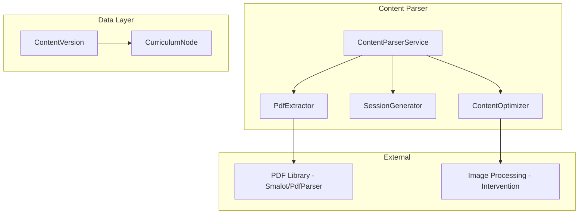

# Design Document: Content Parser

## Overview

The Content Parser transforms PDF documents into structured, mobile-optimized curriculum nodes. It extracts text and images, splits content into sessions based on page ranges or detected chapters, and stores the result as HTML for efficient mobile rendering.

## Architecture



## Components and Interfaces

### 1. ContentVersion Model

```php
namespace App\Models;

class ContentVersion extends Model
{
    protected $fillable = [
        'node_id',
        'version',
        'source_file_path',
        'source_file_name',
        'page_count',
        'is_published',
        'is_manually_edited',
        'parsed_at',
        'published_at',
        'metadata',
    ];

    protected $casts = [
        'version' => 'integer',
        'page_count' => 'integer',
        'is_published' => 'boolean',
        'is_manually_edited' => 'boolean',
        'parsed_at' => 'datetime',
        'published_at' => 'datetime',
        'metadata' => 'array',
    ];

    public function node(): BelongsTo;
    public function sessions(): HasMany;
}
```

### 2. ContentParserService

```php
namespace App\Services;

class ContentParserService
{
    public function __construct(
        private PdfExtractor $pdfExtractor,
        private SessionGenerator $sessionGenerator,
        private ContentOptimizer $optimizer
    ) {}

    /**
     * Parse PDF and generate session nodes
     */
    public function parsePdf(
        CurriculumNode $parentNode,
        UploadedFile $pdf,
        ?array $pageRanges = null
    ): ContentVersion;
    
    /**
     * Re-parse with warning for edited content
     */
    public function reParse(
        ContentVersion $version,
        ?array $pageRanges = null
    ): ContentVersion;
    
    /**
     * Get parsing status/progress
     */
    public function getParsingStatus(ContentVersion $version): ParsingStatus;
}
```

### 3. PdfExtractor

```php
namespace App\Services\ContentParser;

class PdfExtractor
{
    /**
     * Extract text and images from PDF
     */
    public function extract(string $pdfPath): ExtractedContent;
    
    /**
     * Extract specific page range
     */
    public function extractPages(string $pdfPath, int $startPage, int $endPage): ExtractedContent;
    
    /**
     * Detect chapter/section boundaries
     */
    public function detectSections(ExtractedContent $content): array;
}
```

### 4. SessionGenerator

```php
namespace App\Services\ContentParser;

class SessionGenerator
{
    /**
     * Generate session nodes from extracted content
     */
    public function generate(
        CurriculumNode $parent,
        ExtractedContent $content,
        array $pageRanges
    ): Collection;
    
    /**
     * Auto-generate page ranges from detected sections
     */
    public function autoGenerateRanges(ExtractedContent $content): array;
    
    /**
     * Generate session title from content
     */
    public function generateTitle(ExtractedContent $sessionContent, int $sessionNumber): string;
}
```

### 5. ContentOptimizer

```php
namespace App\Services\ContentParser;

class ContentOptimizer
{
    /**
     * Optimize content for mobile
     */
    public function optimize(ExtractedContent $content): OptimizedContent;
    
    /**
     * Compress and resize images
     */
    public function optimizeImages(array $images, int $maxWidth = 800): array;
    
    /**
     * Convert to mobile-friendly HTML
     */
    public function toHtml(ExtractedContent $content): string;
    
    /**
     * Paginate content if too large
     */
    public function paginate(string $html, int $maxSizeKb = 100): array;
}
```

### 6. ExtractedContent DTO

```php
namespace App\DTOs;

class ExtractedContent
{
    public function __construct(
        public readonly array $pages,
        public readonly array $images,
        public readonly array $headings,
        public readonly int $pageCount,
        public readonly array $metadata,
    ) {}
}
```

## Data Models

### Database Schema

```sql
CREATE TABLE content_versions (
    id BIGINT UNSIGNED AUTO_INCREMENT PRIMARY KEY,
    node_id BIGINT UNSIGNED NOT NULL,
    version INT UNSIGNED DEFAULT 1,
    source_file_path VARCHAR(500) NOT NULL,
    source_file_name VARCHAR(255) NOT NULL,
    page_count INT UNSIGNED NOT NULL,
    is_published BOOLEAN DEFAULT FALSE,
    is_manually_edited BOOLEAN DEFAULT FALSE,
    parsed_at TIMESTAMP NULL,
    published_at TIMESTAMP NULL,
    metadata JSON NULL,
    created_at TIMESTAMP DEFAULT CURRENT_TIMESTAMP,
    updated_at TIMESTAMP DEFAULT CURRENT_TIMESTAMP ON UPDATE CURRENT_TIMESTAMP,
    
    FOREIGN KEY (node_id) REFERENCES curriculum_nodes(id) ON DELETE CASCADE,
    
    INDEX idx_node_version (node_id, version),
    INDEX idx_published (is_published)
);

CREATE TABLE parsed_images (
    id BIGINT UNSIGNED AUTO_INCREMENT PRIMARY KEY,
    content_version_id BIGINT UNSIGNED NOT NULL,
    original_path VARCHAR(500) NOT NULL,
    optimized_path VARCHAR(500) NOT NULL,
    page_number INT UNSIGNED NOT NULL,
    width INT UNSIGNED,
    height INT UNSIGNED,
    file_size INT UNSIGNED,
    
    FOREIGN KEY (content_version_id) REFERENCES content_versions(id) ON DELETE CASCADE
);
```

### JSON Schema: Page Ranges

```json
{
    "page_ranges": [
        { "start": 1, "end": 5, "title": "Session 1: Introduction" },
        { "start": 6, "end": 12, "title": "Session 2: Core Concepts" },
        { "start": 13, "end": 20, "title": null }
    ]
}
```

### Node Properties: Parsed Content

```json
{
    "content_html": "<h2>Session 1</h2><p>Content here...</p>",
    "content_version_id": 1,
    "page_range": { "start": 1, "end": 5 },
    "images": [
        { "id": 1, "url": "/storage/images/123.jpg", "caption": null }
    ],
    "word_count": 1500,
    "estimated_read_time_minutes": 6
}
```


## Correctness Properties

*A property is a characteristic or behavior that should hold true across all valid executions of a system-essentially, a formal statement about what the system should do. Properties serve as the bridge between human-readable specifications and machine-verifiable correctness guarantees.*

### Property 1: PDF Extraction Completeness
*For any* PDF with N pages, text content, and images, extraction SHALL return content from all N pages with formatting preserved and images stored separately.
**Validates: Requirements 1.1, 1.2, 1.3**

### Property 2: Processing Report Accuracy
*For any* parsed PDF, the report SHALL contain the correct page_count matching the actual PDF pages.
**Validates: Requirements 1.4**

### Property 3: Session Generation from Ranges
*For any* set of N page ranges, exactly N session nodes SHALL be created with correct position ordering (1, 2, 3...).
**Validates: Requirements 2.1, 2.4**

### Property 4: Auto-Detection Creates Sessions
*For any* PDF parsed without page ranges, at least one session SHALL be created based on detected sections or as a single session.
**Validates: Requirements 2.2**

### Property 5: Session Title Generation
*For any* created session, the title SHALL be non-empty (either from first heading or "Session N").
**Validates: Requirements 2.3**

### Property 6: Content Storage as HTML
*For any* parsed session, the node's properties.content_html SHALL contain valid HTML ready for rendering.
**Validates: Requirements 3.1, 3.4**

### Property 7: Image Optimization
*For any* extracted image, the optimized version SHALL have width <= max_width and file_size <= original_size.
**Validates: Requirements 3.2**

### Property 8: Large Content Pagination
*For any* content exceeding the size threshold, the result SHALL be paginated into multiple chunks each under the threshold.
**Validates: Requirements 3.3**

### Property 9: Edit Persistence with Modified Flag
*For any* edited session content, the changes SHALL be saved and is_manually_edited SHALL be true.
**Validates: Requirements 4.1, 4.2**

### Property 10: Re-parse Warning for Edited Content
*For any* re-parse of content where is_manually_edited is true, the system SHALL return a warning before proceeding.
**Validates: Requirements 4.3**

### Property 11: Version Creation and Retrieval
*For any* new PDF upload to an existing unit, a new ContentVersion SHALL be created with version incremented, and all versions SHALL be retrievable.
**Validates: Requirements 5.1, 5.2**

### Property 12: Version Publishing
*For any* published version, is_published SHALL be true and it SHALL be the version returned to students.
**Validates: Requirements 5.3**

## Error Handling

- **PdfParseException**: Thrown when PDF cannot be parsed (corrupted, encrypted)
- **InvalidPageRangeException**: Thrown when page range exceeds PDF page count
- **ImageExtractionException**: Thrown when image cannot be extracted
- **ContentTooLargeException**: Thrown when content cannot be paginated under threshold

## Testing Strategy

### Property-Based Testing Library
PHPUnit with eris/eris for property-based tests.

### Test Data Generators
```php
// Page range generator
$rangeGen = Generator::bind(
    Generator::tuple(Generator::int(1, 50), Generator::int(1, 50)),
    fn($pair) => ['start' => min($pair), 'end' => max($pair)]
);

// Multiple ranges generator (non-overlapping)
$rangesGen = Generator::listOf($rangeGen, 1, 5)
    ->map(fn($ranges) => sortAndMergeRanges($ranges));

// Content size generator
$contentGen = Generator::string()->map(fn($s) => str_repeat($s, rand(1, 1000)));
```

### External Dependencies
- **smalot/pdfparser**: PHP library for PDF text extraction
- **intervention/image**: PHP library for image processing
