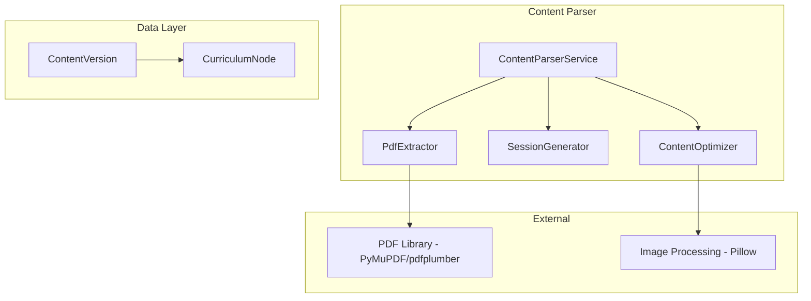

# Design Document: Content Parser

> **🔄 Migration Notice:** This spec is being migrated from PHP/Laravel to Python/Django. All code examples, models, and implementation details are written for Django. The original Laravel implementation exists in the codebase and will be replaced.

## Overview

The Content Parser transforms PDF documents into structured, mobile-optimized curriculum nodes. It extracts text and images, splits content into sessions based on page ranges or detected chapters, and stores the result as HTML for efficient mobile rendering.

## Architecture



## Components and Interfaces

### 1. ContentVersion Model

```python
from django.db import models

class ContentVersion(models.Model):
    node = models.ForeignKey('CurriculumNode', on_delete=models.CASCADE, related_name='content_versions')
    version = models.PositiveIntegerField(default=1)
    source_file_path = models.CharField(max_length=500)
    source_file_name = models.CharField(max_length=255)
    page_count = models.PositiveIntegerField()
    is_published = models.BooleanField(default=False)
    is_manually_edited = models.BooleanField(default=False)
    parsed_at = models.DateTimeField(blank=True, null=True)
    published_at = models.DateTimeField(blank=True, null=True)
    metadata = models.JSONField(blank=True, null=True)
    created_at = models.DateTimeField(auto_now_add=True)
    updated_at = models.DateTimeField(auto_now=True)

    class Meta:
        db_table = 'content_versions'
        indexes = [
            models.Index(fields=['node', 'version']),
            models.Index(fields=['is_published']),
        ]
```

### 2. ContentParserService

```python
from dataclasses import dataclass
from typing import List, Optional

@dataclass
class ExtractedContent:
    pages: List[dict]
    images: List[dict]
    headings: List[str]
    page_count: int
    metadata: dict

class ContentParserService:
    def __init__(self, pdf_extractor, session_generator, optimizer):
        self.pdf_extractor = pdf_extractor
        self.session_generator = session_generator
        self.optimizer = optimizer

    def parse_pdf(self, parent_node, pdf_file, page_ranges=None) -> ContentVersion:
        content = self.pdf_extractor.extract(pdf_file.path)
        
        if page_ranges is None:
            page_ranges = self.session_generator.auto_generate_ranges(content)
        
        sessions = self.session_generator.generate(parent_node, content, page_ranges)
        
        for session in sessions:
            optimized = self.optimizer.optimize(session.content)
            session.properties['content_html'] = self.optimizer.to_html(optimized)
            session.save()
        
        return ContentVersion.objects.create(
            node=parent_node,
            source_file_path=pdf_file.path,
            source_file_name=pdf_file.name,
            page_count=content.page_count,
            parsed_at=timezone.now()
        )

    def re_parse(self, version, page_ranges=None) -> ContentVersion:
        if version.is_manually_edited:
            raise ManuallyEditedWarning("Content has been manually edited")
        return self.parse_pdf(version.node, version.source_file_path, page_ranges)
```


### 3. PdfExtractor

```python
import fitz  # PyMuPDF

class PdfExtractor:
    def extract(self, pdf_path: str) -> ExtractedContent:
        doc = fitz.open(pdf_path)
        pages = []
        images = []
        headings = []
        
        for page_num, page in enumerate(doc):
            text = page.get_text()
            pages.append({'page': page_num + 1, 'text': text})
            
            for img in page.get_images():
                images.append({'page': page_num + 1, 'image': img})
        
        return ExtractedContent(
            pages=pages,
            images=images,
            headings=headings,
            page_count=len(doc),
            metadata={'title': doc.metadata.get('title', '')}
        )

    def extract_pages(self, pdf_path: str, start_page: int, end_page: int) -> ExtractedContent:
        doc = fitz.open(pdf_path)
        pages = []
        for i in range(start_page - 1, min(end_page, len(doc))):
            pages.append({'page': i + 1, 'text': doc[i].get_text()})
        return ExtractedContent(pages=pages, images=[], headings=[], page_count=len(pages), metadata={})

    def detect_sections(self, content: ExtractedContent) -> List[dict]:
        # Detect chapter/section boundaries based on headings
        sections = []
        # Implementation based on font size, bold text, etc.
        return sections
```

### 4. SessionGenerator

```python
class SessionGenerator:
    def generate(self, parent, content: ExtractedContent, page_ranges: List[dict]) -> List:
        sessions = []
        for i, range_info in enumerate(page_ranges):
            title = range_info.get('title') or self.generate_title(content, i + 1)
            session = CurriculumNode.objects.create(
                program=parent.program,
                parent=parent,
                node_type='Session',
                title=title,
                position=i,
                properties={'page_range': range_info}
            )
            sessions.append(session)
        return sessions

    def auto_generate_ranges(self, content: ExtractedContent) -> List[dict]:
        # Auto-detect based on headings or create single session
        if not content.headings:
            return [{'start': 1, 'end': content.page_count, 'title': None}]
        return [{'start': 1, 'end': content.page_count, 'title': None}]

    def generate_title(self, content: ExtractedContent, session_number: int) -> str:
        return f"Session {session_number}"
```

### 5. ContentOptimizer

```python
from PIL import Image
import io

class ContentOptimizer:
    def optimize(self, content: ExtractedContent) -> ExtractedContent:
        optimized_images = self.optimize_images(content.images)
        return ExtractedContent(
            pages=content.pages,
            images=optimized_images,
            headings=content.headings,
            page_count=content.page_count,
            metadata=content.metadata
        )

    def optimize_images(self, images: List[dict], max_width: int = 800) -> List[dict]:
        optimized = []
        for img_data in images:
            img = Image.open(io.BytesIO(img_data['data']))
            if img.width > max_width:
                ratio = max_width / img.width
                img = img.resize((max_width, int(img.height * ratio)))
            optimized.append({'page': img_data['page'], 'image': img})
        return optimized

    def to_html(self, content: ExtractedContent) -> str:
        html_parts = []
        for page in content.pages:
            html_parts.append(f"<div class='page'>{page['text']}</div>")
        return '\n'.join(html_parts)

    def paginate(self, html: str, max_size_kb: int = 100) -> List[str]:
        max_bytes = max_size_kb * 1024
        if len(html.encode()) <= max_bytes:
            return [html]
        # Split into chunks
        chunks = []
        current = ""
        for line in html.split('\n'):
            if len((current + line).encode()) > max_bytes:
                chunks.append(current)
                current = line
            else:
                current += '\n' + line
        if current:
            chunks.append(current)
        return chunks
```


## Data Models

### Database Schema

```sql
CREATE TABLE content_versions (
    id BIGSERIAL PRIMARY KEY,
    node_id BIGINT NOT NULL REFERENCES curriculum_nodes(id) ON DELETE CASCADE,
    version INTEGER DEFAULT 1,
    source_file_path VARCHAR(500) NOT NULL,
    source_file_name VARCHAR(255) NOT NULL,
    page_count INTEGER NOT NULL,
    is_published BOOLEAN DEFAULT FALSE,
    is_manually_edited BOOLEAN DEFAULT FALSE,
    parsed_at TIMESTAMP NULL,
    published_at TIMESTAMP NULL,
    metadata JSONB NULL,
    created_at TIMESTAMP DEFAULT CURRENT_TIMESTAMP,
    updated_at TIMESTAMP DEFAULT CURRENT_TIMESTAMP
);

CREATE TABLE parsed_images (
    id BIGSERIAL PRIMARY KEY,
    content_version_id BIGINT NOT NULL REFERENCES content_versions(id) ON DELETE CASCADE,
    original_path VARCHAR(500) NOT NULL,
    optimized_path VARCHAR(500) NOT NULL,
    page_number INTEGER NOT NULL,
    width INTEGER,
    height INTEGER,
    file_size INTEGER
);
```

## Correctness Properties

### Property 1: PDF Extraction Completeness
*For any* PDF with N pages, text content, and images, extraction SHALL return content from all N pages with formatting preserved and images stored separately.
**Validates: Requirements 1.1, 1.2, 1.3**

### Property 2: Processing Report Accuracy
*For any* parsed PDF, the report SHALL contain the correct page_count matching the actual PDF pages.
**Validates: Requirements 1.4**

### Property 3: Session Generation from Ranges
*For any* set of N page ranges, exactly N session nodes SHALL be created with correct position ordering (1, 2, 3...).
**Validates: Requirements 2.1, 2.4**

### Property 4: Auto-Detection Creates Sessions
*For any* PDF parsed without page ranges, at least one session SHALL be created based on detected sections or as a single session.
**Validates: Requirements 2.2**

### Property 5: Session Title Generation
*For any* created session, the title SHALL be non-empty (either from first heading or "Session N").
**Validates: Requirements 2.3**

### Property 6: Content Storage as HTML
*For any* parsed session, the node's properties.content_html SHALL contain valid HTML ready for rendering.
**Validates: Requirements 3.1, 3.4**

### Property 7: Image Optimization
*For any* extracted image, the optimized version SHALL have width <= max_width and file_size <= original_size.
**Validates: Requirements 3.2**

### Property 8: Large Content Pagination
*For any* content exceeding the size threshold, the result SHALL be paginated into multiple chunks each under the threshold.
**Validates: Requirements 3.3**

### Property 9-12: Edit Persistence, Re-parse Warning, Version Creation, Version Publishing
(See requirements 4.1-4.3, 5.1-5.3)

## Testing Strategy

### Property-Based Testing Library
We will use **Hypothesis** for property-based tests, **PyMuPDF** for PDF extraction, and **Pillow** for image processing.

```python
from hypothesis import strategies as st

page_range_strategy = st.fixed_dictionaries({
    'start': st.integers(min_value=1, max_value=50),
    'end': st.integers(min_value=1, max_value=50),
    'title': st.one_of(st.none(), st.text(min_size=1, max_size=100))
}).filter(lambda x: x['start'] <= x['end'])
```
