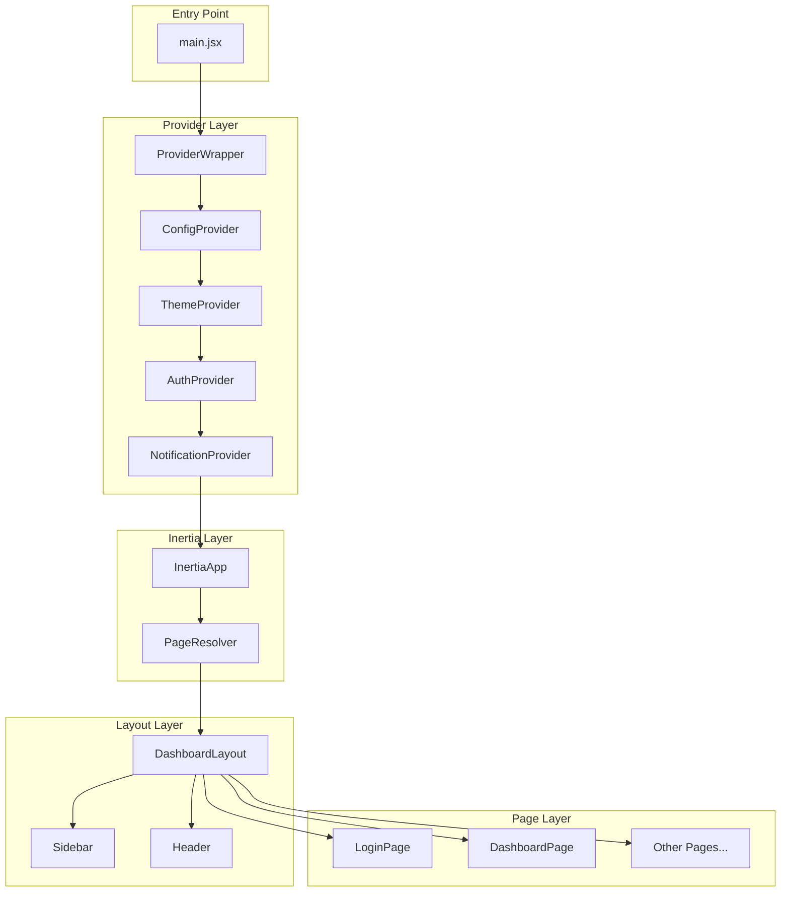

# Design Document: LMS Frontend Core

## Overview

The LMS Frontend Core provides the foundational React infrastructure for the Crossview LMS. It establishes the theme system, provider architecture, layout components, and authentication flow that all other frontend features build upon.

This design adapts patterns from modern React applications (MUI 7, context providers, lazy loading) while integrating with Django via Inertia.js for seamless server-side rendering and data passing.

## Architecture



## Components and Interfaces

### 1. Entry Point (main.jsx)

```javascript
// frontend/src/main.jsx
import { createRoot } from "react-dom/client";
import { createInertiaApp } from "@inertiajs/react";
import ProviderWrapper from "./app/ProviderWrapper";
import "./styles/index.css";
import "@/config"; // Load fonts

createInertiaApp({
    resolve: (name) => {
        const pages = import.meta.glob("./Pages/**/*.jsx", { eager: true });
        return pages[`./Pages/${name}.jsx`];
    },
    setup({ el, App, props }) {
        createRoot(el).render(
            <ProviderWrapper>
                <App {...props} />
            </ProviderWrapper>
        );
    },
});
```

### 2. Config Module (config.js)

```javascript
// frontend/src/config.js
import "@fontsource/archivo/400.css";
import "@fontsource/archivo/500.css";
import "@fontsource/archivo/600.css";
import "@fontsource/archivo/700.css";
import "@fontsource/figtree/400.css";
import "@fontsource/figtree/500.css";
import "@fontsource/figtree/600.css";
import "@fontsource/figtree/700.css";

export const FONT_ARCHIVO = "Archivo, sans-serif";
export const FONT_FIGTREE = "Figtree, sans-serif";

export const defaultConfig = {
    themeMode: "light",
    sidebarCollapsed: false,
    blueprintId: null,
};
```

### 3. Theme Palette (theme/palette.js)

```javascript
// frontend/src/theme/palette.js
export default function palette() {
    const textPrimary = "#1A1C1E";
    const textSecondary = "#42474E";
    const divider = "#C2C7CE";
    const background = "#F8FAFC";

    return {
        primary: {
            lighter: "#DBEAFE", // blue-100
            light: "#3B82F6", // blue-500
            main: "#2563EB", // blue-600 - Deep Blue
            dark: "#1E40AF", // blue-800
            darker: "#1E3A8A", // blue-900
            contrastText: "#FFFFFF",
        },
        secondary: {
            lighter: "#CCFBF1", // teal-100
            light: "#2DD4BF", // teal-400
            main: "#14B8A6", // teal-500 - Vibrant Teal
            dark: "#0D9488", // teal-600
            darker: "#115E59", // teal-800
            contrastText: "#FFFFFF",
        },
        success: {
            lighter: "#D1FAE5", // emerald-100
            light: "#34D399", // emerald-400
            main: "#10B981", // emerald-500 - Fresh Green
            dark: "#059669", // emerald-600
            darker: "#065F46", // emerald-800
            contrastText: "#FFFFFF",
        },
        warning: {
            lighter: "#FFEDD5", // orange-100
            light: "#FB923C", // orange-400
            main: "#F97316", // orange-500 - Warm Coral
            dark: "#EA580C", // orange-600
            darker: "#9A3412", // orange-800
            contrastText: "#FFFFFF",
        },
        info: {
            lighter: "#DBEAFE", // blue-100
            light: "#60A5FA", // blue-400
            main: "#3B82F6", // blue-500 - Soft Sky Blue
            dark: "#2563EB", // blue-600
            darker: "#1E40AF", // blue-800
            contrastText: "#FFFFFF",
        },
        error: {
            lighter: "#FEE2E2",
            light: "#F87171",
            main: "#EF4444",
            dark: "#DC2626",
            darker: "#991B1B",
            contrastText: "#FFFFFF",
        },
        grey: {
            50: "#F8FAFC",
            100: "#F1F5F9",
            200: "#E2E8F0",
            300: "#CBD5E1",
            400: "#94A3B8",
            500: "#64748B",
            600: divider,
            700: "#475569",
            800: textSecondary,
            900: textPrimary,
        },
        text: {
            primary: textPrimary,
            secondary: textSecondary,
        },
        divider,
        background: {
            default: background,
            paper: "#FFFFFF",
        },
    };
}
```

### 4. Theme Typography (theme/typography.js)

```javascript
// frontend/src/theme/typography.js
import { FONT_ARCHIVO, FONT_FIGTREE } from "@/config";

export default function typography(theme) {
    return {
        fontFamily: FONT_ARCHIVO,

        h1: {
            fontWeight: 700,
            fontSize: 48,
            lineHeight: 1.2,
            letterSpacing: -0.5,
            [theme.breakpoints.down("md")]: { fontSize: 36 },
            [theme.breakpoints.down("sm")]: { fontSize: 28 },
        },
        h2: {
            fontWeight: 700,
            fontSize: 36,
            lineHeight: 1.25,
            [theme.breakpoints.down("md")]: { fontSize: 28 },
            [theme.breakpoints.down("sm")]: { fontSize: 24 },
        },
        h3: {
            fontWeight: 600,
            fontSize: 28,
            lineHeight: 1.3,
            [theme.breakpoints.down("md")]: { fontSize: 24 },
            [theme.breakpoints.down("sm")]: { fontSize: 20 },
        },
        h4: {
            fontWeight: 600,
            fontSize: 24,
            lineHeight: 1.35,
            [theme.breakpoints.down("md")]: { fontSize: 20 },
            [theme.breakpoints.down("sm")]: { fontSize: 18 },
        },
        h5: {
            fontFamily: FONT_FIGTREE,
            fontWeight: 600,
            fontSize: 20,
            lineHeight: 1.4,
        },
        h6: {
            fontFamily: FONT_FIGTREE,
            fontWeight: 600,
            fontSize: 18,
            lineHeight: 1.45,
        },
        body1: {
            fontFamily: FONT_FIGTREE,
            fontWeight: 400,
            fontSize: 16,
            lineHeight: 1.6,
        },
        body2: {
            fontFamily: FONT_FIGTREE,
            fontWeight: 400,
            fontSize: 14,
            lineHeight: 1.5,
        },
        subtitle1: {
            fontFamily: FONT_FIGTREE,
            fontWeight: 500,
            fontSize: 16,
            lineHeight: 1.5,
        },
        subtitle2: {
            fontFamily: FONT_FIGTREE,
            fontWeight: 500,
            fontSize: 14,
            lineHeight: 1.45,
        },
        caption: {
            fontFamily: FONT_FIGTREE,
            fontWeight: 400,
            fontSize: 12,
            lineHeight: 1.4,
        },
        button: {
            fontFamily: FONT_FIGTREE,
            fontWeight: 600,
            textTransform: "none",
        },
    };
}
```

### 5. Theme Index (theme/index.jsx)

```javascript
// frontend/src/theme/index.jsx
import { useMemo } from "react";
import {
    createTheme,
    ThemeProvider as MuiThemeProvider,
} from "@mui/material/styles";
import CssBaseline from "@mui/material/CssBaseline";
import palette from "./palette";
import typography from "./typography";
import componentsOverride from "./overrides";

export default function ThemeProvider({ children }) {
    const themePalette = useMemo(() => palette(), []);

    let themeDefault = createTheme({
        breakpoints: {
            values: { xs: 0, sm: 768, md: 1024, lg: 1266, xl: 1440 },
        },
        direction: "ltr",
        palette: themePalette,
    });

    let theme = createTheme({
        ...themeDefault,
        typography: typography(themeDefault),
    });

    theme.components = componentsOverride(theme);

    return (
        <MuiThemeProvider theme={theme}>
            <CssBaseline enableColorScheme />
            {children}
        </MuiThemeProvider>
    );
}
```

### 6. ConfigContext (contexts/ConfigContext.jsx)

```javascript
// frontend/src/contexts/ConfigContext.jsx
import { createContext, useContext } from "react";
import useLocalStorage from "@/hooks/useLocalStorage";
import { defaultConfig } from "@/config";

const ConfigContext = createContext(undefined);

export function ConfigProvider({ children }) {
    const [config, setConfig] = useLocalStorage(
        "crossview-lms-config",
        defaultConfig
    );

    const updateConfig = (updates) => {
        setConfig({ ...config, ...updates });
    };

    const toggleSidebar = () => {
        setConfig({ ...config, sidebarCollapsed: !config.sidebarCollapsed });
    };

    const setBlueprint = (blueprintId) => {
        setConfig({ ...config, blueprintId });
    };

    return (
        <ConfigContext.Provider
            value={{ ...config, updateConfig, toggleSidebar, setBlueprint }}
        >
            {children}
        </ConfigContext.Provider>
    );
}

export function useConfig() {
    const context = useContext(ConfigContext);
    if (!context)
        throw new Error("useConfig must be used within ConfigProvider");
    return context;
}
```

### 7. AuthContext (contexts/AuthContext.jsx)

```javascript
// frontend/src/contexts/AuthContext.jsx
import { createContext, useContext, useState, useCallback } from "react";
import { router, usePage } from "@inertiajs/react";

const AuthContext = createContext(undefined);

export function AuthProvider({ children }) {
    const { auth } = usePage().props;
    const [user, setUser] = useState(auth?.user || null);

    const login = useCallback(async (credentials) => {
        return new Promise((resolve, reject) => {
            router.post("/login", credentials, {
                onSuccess: (page) => {
                    setUser(page.props.auth?.user);
                    resolve();
                },
                onError: (errors) => reject(errors),
            });
        });
    }, []);

    const logout = useCallback(async () => {
        return new Promise((resolve) => {
            router.post(
                "/logout",
                {},
                {
                    onSuccess: () => {
                        setUser(null);
                        resolve();
                    },
                }
            );
        });
    }, []);

    const refreshUser = useCallback(() => {
        router.reload({ only: ["auth"] });
    }, []);

    return (
        <AuthContext.Provider
            value={{
                user,
                isAuthenticated: !!user,
                login,
                logout,
                refreshUser,
            }}
        >
            {children}
        </AuthContext.Provider>
    );
}

export function useAuth() {
    const context = useContext(AuthContext);
    if (!context) throw new Error("useAuth must be used within AuthProvider");
    return context;
}
```

### 8. ProviderWrapper (app/ProviderWrapper.jsx)

```javascript
// frontend/src/app/ProviderWrapper.jsx
import { useState, useEffect } from "react";
import { ConfigProvider } from "@/contexts/ConfigContext";
import { AuthProvider } from "@/contexts/AuthContext";
import ThemeProvider from "@/theme";
import Loader from "@/components/Loader";

export default function ProviderWrapper({ children }) {
    const [loading, setLoading] = useState(true);

    useEffect(() => {
        setLoading(false);
    }, []);

    return (
        <ConfigProvider>
            <ThemeProvider>
                <AuthProvider>
                    <main>{loading ? <Loader /> : children}</main>
                </AuthProvider>
            </ThemeProvider>
        </ConfigProvider>
    );
}
```

### 9. DashboardLayout (layouts/DashboardLayout/index.jsx)

```javascript
// frontend/src/layouts/DashboardLayout/index.jsx
import { useState } from "react";
import { Box, useMediaQuery, useTheme } from "@mui/material";
import Sidebar from "./Sidebar";
import Header from "./Header";
import { useConfig } from "@/contexts/ConfigContext";

const DRAWER_WIDTH = 260;
const DRAWER_WIDTH_COLLAPSED = 72;

export default function DashboardLayout({ children }) {
    const theme = useTheme();
    const isMobile = useMediaQuery(theme.breakpoints.down("md"));
    const { sidebarCollapsed, toggleSidebar } = useConfig();
    const [mobileOpen, setMobileOpen] = useState(false);

    const handleSidebarToggle = () => {
        if (isMobile) {
            setMobileOpen(!mobileOpen);
        } else {
            toggleSidebar();
        }
    };

    const drawerWidth = sidebarCollapsed
        ? DRAWER_WIDTH_COLLAPSED
        : DRAWER_WIDTH;

    return (
        <Box sx={{ display: "flex", minHeight: "100vh" }}>
            <Sidebar
                open={!sidebarCollapsed}
                mobileOpen={mobileOpen}
                onMobileClose={() => setMobileOpen(false)}
                drawerWidth={drawerWidth}
                isMobile={isMobile}
            />
            <Box
                component="main"
                sx={{
                    flexGrow: 1,
                    display: "flex",
                    flexDirection: "column",
                    minHeight: "100vh",
                    width: { md: `calc(100% - ${drawerWidth}px)` },
                    ml: { md: `${drawerWidth}px` },
                    transition: theme.transitions.create(["margin", "width"], {
                        easing: theme.transitions.easing.sharp,
                        duration: theme.transitions.duration.leavingScreen,
                    }),
                }}
            >
                <Header
                    onMenuClick={handleSidebarToggle}
                    sidebarOpen={!sidebarCollapsed}
                    isMobile={isMobile}
                />
                <Box
                    sx={{
                        flexGrow: 1,
                        p: 3,
                        backgroundColor: "background.default",
                    }}
                >
                    {children}
                </Box>
            </Box>
        </Box>
    );
}
```

### 10. Sidebar Component Interface

```typescript
// Type definitions for Sidebar
interface SidebarProps {
    open: boolean;
    mobileOpen: boolean;
    onMobileClose: () => void;
    drawerWidth: number;
    isMobile: boolean;
}

interface NavigationItem {
    path: string;
    label: string;
    icon: React.ComponentType;
    roles?: ("student" | "instructor" | "admin")[];
}
```

### 11. Header Component Interface

```typescript
// Type definitions for Header
interface HeaderProps {
    onMenuClick: () => void;
    sidebarOpen: boolean;
    isMobile: boolean;
}
```

## Data Models

### User Model (from Django)

```typescript
interface User {
    id: number;
    email: string;
    first_name: string;
    last_name: string;
    role: "student" | "instructor" | "admin";
    tenant_id: number;
    avatar_url?: string;
}
```

### Config Model (localStorage)

```typescript
interface Config {
    themeMode: "light" | "dark";
    sidebarCollapsed: boolean;
    blueprintId: number | null;
}
```

### Inertia Page Props

```typescript
interface PageProps {
    auth: {
        user: User | null;
    };
    flash: {
        success?: string;
        error?: string;
    };
    errors: Record<string, string>;
}
```

## Correctness Properties

_A property is a characteristic or behavior that should hold true across all valid executions of a system—essentially, a formal statement about what the system should do. Properties serve as the bridge between human-readable specifications and machine-verifiable correctness guarantees._

### Property 1: Page Resolution Consistency

_For any_ valid page name string, the Inertia page resolver SHALL return the corresponding React component from the Pages directory, and the same page name SHALL always resolve to the same component.

**Validates: Requirements 1.7, 10.1**

### Property 2: Theme Palette Color Integrity

_For any_ call to the palette function, the returned object SHALL contain all required color keys (primary, secondary, success, warning, info, error, grey, text, divider, background) with valid hex color values that match the Crossview brand specification.

**Validates: Requirements 2.1**

### Property 3: Typography Font Family Assignment

_For any_ typography variant, heading variants (h1, h2, h3, h4) SHALL use Archivo font family, and body variants (body1, body2, subtitle1, subtitle2, caption, button) SHALL use Figtree font family.

**Validates: Requirements 2.2, 2.3**

### Property 4: Config Persistence Round-Trip

_For any_ valid config object, storing it via ConfigContext and then retrieving it from localStorage SHALL produce an equivalent config object.

**Validates: Requirements 3.3, 4.3**

### Property 5: Authentication State Consistency

_For any_ user object (including null), the Auth_Context isAuthenticated property SHALL be true if and only if user is not null.

**Validates: Requirements 3.9**

### Property 6: Sidebar Width State

_For any_ sidebar collapsed state (true or false), the sidebar width SHALL be 72px when collapsed and 260px when expanded.

**Validates: Requirements 4.1**

### Property 7: Role-Based Navigation Filtering

_For any_ user role (student, instructor, admin), the Sidebar SHALL display only navigation items that include that role in their allowed roles list, or items with no role restriction.

**Validates: Requirements 5.2**

### Property 8: Avatar Initials Generation

_For any_ user object with first_name and/or last_name, the Header avatar SHALL display initials derived from the first character of first_name and last_name. If both are empty, it SHALL display a fallback character.

**Validates: Requirements 6.3**

### Property 9: Login Redirect by Role

_For any_ successful login with a user having a specific role, the system SHALL redirect to the appropriate dashboard path for that role (student → /dashboard, instructor → /instructor, admin → /admin).

**Validates: Requirements 7.4**

### Property 10: Breadcrumb Path Generation

_For any_ valid route path, the Breadcrumbs component SHALL generate an array of path segments where each segment is navigable and the final segment represents the current page.

**Validates: Requirements 8.2**

### Property 11: Accessibility Compliance

_For any_ interactive component (buttons, links, form inputs), the component SHALL have appropriate ARIA attributes (aria-label, role, tabIndex) and be keyboard-focusable.

**Validates: Requirements 8.8, 9.2, 9.4**

### Property 12: Color Contrast Compliance

_For any_ text-background color combination in the theme, the contrast ratio SHALL meet WCAG 2.1 AA standards (minimum 4.5:1 for normal text, 3:1 for large text).

**Validates: Requirements 9.3**

## Error Handling

### Network Errors

-   Display user-friendly error message with retry option
-   Log error details to console for debugging
-   Preserve user's current state when possible

### Authentication Errors

-   Display generic "Invalid credentials" message (don't reveal which field is wrong)
-   Clear password field but preserve email
-   Redirect to login page on session expiration

### Form Validation Errors

-   Display inline error messages below each invalid field
-   Highlight invalid fields with error color
-   Focus first invalid field for accessibility

### Component Errors

-   Use React Error Boundary to catch rendering errors
-   Display fallback UI with error message and retry option
-   Log error to monitoring service

### Loading States

-   Show skeleton loaders for content areas
-   Show spinner for actions (login, form submit)
-   Disable interactive elements during loading

## Testing Strategy

### Unit Tests

Unit tests verify specific examples and edge cases:

-   Theme palette returns correct color values
-   Typography config uses correct fonts
-   ConfigContext stores and retrieves values
-   AuthContext provides correct authentication state
-   Component renders with required props
-   Event handlers are called correctly

### Property-Based Tests

Property-based tests verify universal properties across all inputs using **fast-check** library:

-   **Minimum 100 iterations** per property test
-   Each test references its design document property
-   Tag format: **Feature: lms-frontend-core, Property {number}: {property_text}**

### Test Configuration

```javascript
// vitest.config.js
import { defineConfig } from "vitest/config";
import react from "@vitejs/plugin-react";
import { resolve } from "path";

export default defineConfig({
    plugins: [react()],
    test: {
        environment: "jsdom",
        globals: true,
        setupFiles: ["./src/test/setup.js"],
        coverage: {
            reporter: ["text", "json", "html"],
        },
    },
    resolve: {
        alias: {
            "@": resolve(__dirname, "./frontend/src"),
        },
    },
});
```

### Test File Structure

```
frontend/src/
├── theme/
│   ├── palette.js
│   ├── palette.test.js
│   ├── typography.js
│   └── typography.test.js
├── contexts/
│   ├── ConfigContext.jsx
│   ├── ConfigContext.test.jsx
│   ├── AuthContext.jsx
│   └── AuthContext.test.jsx
├── layouts/
│   └── DashboardLayout/
│       ├── index.jsx
│       ├── index.test.jsx
│       ├── Sidebar.jsx
│       ├── Sidebar.test.jsx
│       ├── Header.jsx
│       └── Header.test.jsx
├── components/
│   ├── Loader.jsx
│   ├── Loader.test.jsx
│   ├── Breadcrumbs.jsx
│   ├── Breadcrumbs.test.jsx
│   └── ...
└── test/
    ├── setup.js
    └── utils.jsx
```

### Testing Libraries

-   **vitest**: Test runner
-   **@testing-library/react**: Component testing
-   **@testing-library/jest-dom**: DOM matchers
-   **fast-check**: Property-based testing
-   **msw**: API mocking (for Inertia requests)
