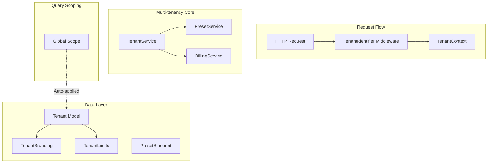

# Design Document: Multi-tenancy

## Overview

The Multi-tenancy system enables the LMS to serve multiple institutions from a single codebase with complete data isolation. It uses subdomain-based tenant identification, automatic query scoping, and preset blueprints for quick onboarding. This supports the SaaS expansion strategy targeting TVET colleges, driving schools, K-12 schools, and vocational training centers across Kenya.

## Architecture



## Components and Interfaces

### 1. Tenant Model

```php
namespace App\Models;

class Tenant extends Model
{
    protected $fillable = [
        'name',
        'subdomain',
        'admin_email',
        'subscription_tier_id',
        'is_active',
        'settings',
        'activated_at',
    ];

    protected $casts = [
        'is_active' => 'boolean',
        'settings' => 'array',
        'activated_at' => 'datetime',
    ];

    public function users(): HasMany;
    public function branding(): HasOne;
    public function limits(): HasOne;
    public function blueprints(): HasMany;
    public function subscriptionTier(): BelongsTo;
}
```

### 2. TenantBranding Model

```php
namespace App\Models;

class TenantBranding extends Model
{
    protected $fillable = [
        'tenant_id',
        'logo_path',
        'primary_color',
        'secondary_color',
        'institution_name',
        'tagline',
        'favicon_path',
    ];

    public function tenant(): BelongsTo;
}
```

### 3. PresetBlueprint Model

```php
namespace App\Models;

class PresetBlueprint extends Model
{
    protected $fillable = [
        'name',
        'code',
        'description',
        'regulatory_body',
        'hierarchy_labels',
        'grading_config',
        'structure_rules',
        'is_active',
    ];

    protected $casts = [
        'hierarchy_labels' => 'array',
        'grading_config' => 'array',
        'structure_rules' => 'array',
        'is_active' => 'boolean',
    ];
}
```

### 4. TenantContext (Singleton)

```php
namespace App\Services\Tenancy;

class TenantContext
{
    private ?Tenant $currentTenant = null;

    public function set(Tenant $tenant): void;
    public function get(): ?Tenant;
    public function id(): ?int;
    public function check(): bool;
    public function clear(): void;
}
```

### 5. TenantIdentifier Middleware

```php
namespace App\Http\Middleware;

class TenantIdentifier
{
    public function handle(Request $request, Closure $next)
    {
        $subdomain = $this->extractSubdomain($request);
        $tenant = Tenant::where('subdomain', $subdomain)->first();
        
        if (!$tenant) {
            return response()->view('errors.tenant-not-found', [], 404);
        }
        
        app(TenantContext::class)->set($tenant);
        return $next($request);
    }
}
```

### 6. TenantScope (Global Scope)

```php
namespace App\Scopes;

class TenantScope implements Scope
{
    public function apply(Builder $builder, Model $model): void
    {
        $tenantId = app(TenantContext::class)->id();
        if ($tenantId) {
            $builder->where('tenant_id', $tenantId);
        }
    }
}
```

### 7. TenantService

```php
namespace App\Services;

class TenantService
{
    public function __construct(
        private PresetService $presetService,
        private BillingService $billingService
    ) {}

    public function create(array $data, string $presetCode): Tenant;
    public function provision(Tenant $tenant): void;
    public function delete(Tenant $tenant): void;
    public function getUsageStats(Tenant $tenant): array;
    public function checkLimits(Tenant $tenant, string $resource): bool;
}
```

### 8. PresetService

```php
namespace App\Services;

class PresetService
{
    public function getAll(): Collection;
    public function getByCode(string $code): PresetBlueprint;
    public function copyToTenant(PresetBlueprint $preset, Tenant $tenant): AcademicBlueprint;
    public function seedPresets(): void;
}
```

## Data Models

### Database Schema

```sql
CREATE TABLE tenants (
    id BIGINT UNSIGNED AUTO_INCREMENT PRIMARY KEY,
    name VARCHAR(255) NOT NULL,
    subdomain VARCHAR(100) NOT NULL UNIQUE,
    admin_email VARCHAR(255) NOT NULL,
    subscription_tier_id BIGINT UNSIGNED NULL,
    is_active BOOLEAN DEFAULT TRUE,
    settings JSON NULL,
    activated_at TIMESTAMP NULL,
    created_at TIMESTAMP DEFAULT CURRENT_TIMESTAMP,
    updated_at TIMESTAMP DEFAULT CURRENT_TIMESTAMP ON UPDATE CURRENT_TIMESTAMP,
    deleted_at TIMESTAMP NULL,
    
    INDEX idx_subdomain (subdomain),
    INDEX idx_active (is_active)
);

CREATE TABLE tenant_brandings (
    id BIGINT UNSIGNED AUTO_INCREMENT PRIMARY KEY,
    tenant_id BIGINT UNSIGNED NOT NULL UNIQUE,
    logo_path VARCHAR(500) NULL,
    primary_color VARCHAR(7) DEFAULT '#3B82F6',
    secondary_color VARCHAR(7) DEFAULT '#1E40AF',
    institution_name VARCHAR(255) NULL,
    tagline VARCHAR(255) NULL,
    favicon_path VARCHAR(500) NULL,
    created_at TIMESTAMP DEFAULT CURRENT_TIMESTAMP,
    updated_at TIMESTAMP DEFAULT CURRENT_TIMESTAMP ON UPDATE CURRENT_TIMESTAMP,
    
    FOREIGN KEY (tenant_id) REFERENCES tenants(id) ON DELETE CASCADE
);

CREATE TABLE tenant_limits (
    id BIGINT UNSIGNED AUTO_INCREMENT PRIMARY KEY,
    tenant_id BIGINT UNSIGNED NOT NULL UNIQUE,
    max_students INT UNSIGNED DEFAULT 100,
    max_storage_mb INT UNSIGNED DEFAULT 5000,
    max_programs INT UNSIGNED DEFAULT 10,
    current_students INT UNSIGNED DEFAULT 0,
    current_storage_mb INT UNSIGNED DEFAULT 0,
    current_programs INT UNSIGNED DEFAULT 0,
    
    FOREIGN KEY (tenant_id) REFERENCES tenants(id) ON DELETE CASCADE
);

CREATE TABLE preset_blueprints (
    id BIGINT UNSIGNED AUTO_INCREMENT PRIMARY KEY,
    name VARCHAR(100) NOT NULL,
    code VARCHAR(50) NOT NULL UNIQUE,
    description TEXT NULL,
    regulatory_body VARCHAR(100) NULL,
    hierarchy_labels JSON NOT NULL,
    grading_config JSON NOT NULL,
    structure_rules JSON NULL,
    is_active BOOLEAN DEFAULT TRUE,
    created_at TIMESTAMP DEFAULT CURRENT_TIMESTAMP,
    updated_at TIMESTAMP DEFAULT CURRENT_TIMESTAMP ON UPDATE CURRENT_TIMESTAMP,
    
    INDEX idx_code (code),
    INDEX idx_active (is_active)
);

-- Add tenant_id to existing tables
ALTER TABLE users ADD COLUMN tenant_id BIGINT UNSIGNED NULL;
ALTER TABLE academic_blueprints ADD COLUMN tenant_id BIGINT UNSIGNED NULL;
ALTER TABLE curriculum_nodes ADD COLUMN tenant_id BIGINT UNSIGNED NULL;
ALTER TABLE enrollments ADD COLUMN tenant_id BIGINT UNSIGNED NULL;
-- ... (all tenant-scoped tables)
```

### Preset Blueprint Configurations

```json
// TVET CDACC Standard
{
    "code": "tvet_cdacc",
    "name": "TVET CDACC Standard",
    "regulatory_body": "TVETA/CDACC",
    "hierarchy_labels": ["Qualification", "Module", "Unit of Competency", "Element"],
    "structure_rules": {
        "module_types": ["Basic", "Common", "Core"],
        "element_components": ["Performance Criteria", "Range"]
    },
    "grading_config": {
        "mode": "cbet",
        "scale": ["Competent", "Not Yet Competent"],
        "pass_mark": 50,
        "requirements": [
            {"key": "theory", "label": "Continuous Assessment", "weight": 0.3},
            {"key": "practical", "label": "Practical Project", "weight": 0.7},
            {"key": "portfolio", "label": "Portfolio of Evidence (PoE)", "required": true}
        ]
    }
}

// NITA Trade Test
{
    "code": "nita_trade",
    "name": "NITA Trade Test",
    "regulatory_body": "NITA",
    "hierarchy_labels": ["Trade Area", "Grade Level", "Practical Project"],
    "structure_rules": {
        "levels": ["Grade III (Entry)", "Grade II", "Grade I (Advanced)"]
    },
    "grading_config": {
        "mode": "visual_review",
        "upload_type": "media_gallery",
        "checklist": ["Safety Gear Worn", "Tools Handled Correctly", "Finished Product Quality"]
    }
}

// NTSA Driving Curriculum
{
    "code": "ntsa_driving",
    "name": "NTSA Driving Curriculum",
    "regulatory_body": "NTSA",
    "hierarchy_labels": ["License Class", "Unit", "Lesson Type"],
    "structure_rules": {
        "lesson_types": ["Theory", "Yard Training", "Roadwork"]
    },
    "grading_config": {
        "mode": "instructor_checklist",
        "tracking": "hours_logged",
        "components": [
            {"key": "theory", "label": "Theory Test", "required": true},
            {"key": "yard", "label": "Maneuver Test", "required": true},
            {"key": "road", "label": "Road Test", "required": true}
        ]
    }
}

// CBC K-12 Standard
{
    "code": "cbc_k12",
    "name": "CBC K-12 Standard",
    "regulatory_body": "KICD",
    "hierarchy_labels": ["Grade", "Learning Area", "Strand", "Sub-strand"],
    "grading_config": {
        "mode": "rubric",
        "levels": [
            {"score": 4, "label": "Exceeding Expectation"},
            {"score": 3, "label": "Meeting Expectation"},
            {"score": 2, "label": "Approaching Expectation"},
            {"score": 1, "label": "Below Expectation"}
        ],
        "competencies_tracking": ["Communication", "Critical Thinking", "Digital Literacy"]
    }
}

// CCT Theology Standard
{
    "code": "cct_theology",
    "name": "CCT Theology Standard",
    "regulatory_body": "Internal",
    "hierarchy_labels": ["Program", "Year", "Unit", "Session"],
    "grading_config": {
        "mode": "summative",
        "pass_mark": 40,
        "components": [
            {"key": "cat", "label": "Continuous Assessment", "weight": 0.3},
            {"key": "exam", "label": "Final Examination", "weight": 0.7}
        ]
    }
}
```


## Correctness Properties

*A property is a characteristic or behavior that should hold true across all valid executions of a system-essentially, a formal statement about what the system should do. Properties serve as the bridge between human-readable specifications and machine-verifiable correctness guarantees.*

### Property 1: Tenant Creation with Admin
*For any* tenant registration, a Tenant record SHALL be created with unique subdomain, and a User with admin role SHALL be provisioned for that tenant.
**Validates: Requirements 1.1, 1.2**

### Property 2: Preset Blueprint Copying
*For any* preset selection during tenant setup, an AcademicBlueprint SHALL be created for the tenant with configuration matching the preset.
**Validates: Requirements 1.3, 5.2**

### Property 3: Query Scoping
*For any* database query on a tenant-scoped model, the query SHALL automatically include `WHERE tenant_id = current_tenant_id`.
**Validates: Requirements 2.1**

### Property 4: Cross-Tenant Access Denial
*For any* attempt to access data belonging to a different tenant, access SHALL be denied and the attempt SHALL be logged.
**Validates: Requirements 2.2**

### Property 5: File Storage Isolation
*For any* file upload, the storage path SHALL include the tenant identifier (e.g., `tenants/{tenant_id}/...`).
**Validates: Requirements 2.3**

### Property 6: Tenant Deletion Cascade
*For any* tenant deletion, all associated data (users, blueprints, nodes, enrollments, files) SHALL be removed.
**Validates: Requirements 2.4**

### Property 7: Subdomain Identification
*For any* HTTP request, the tenant SHALL be identified from the subdomain; unknown subdomains SHALL return 404; identified tenants SHALL have context set for the request lifecycle.
**Validates: Requirements 3.1, 3.2, 3.3**

### Property 8: Branding Configuration
*For any* tenant branding update, the settings (logo, colors, name) SHALL be persisted; missing branding SHALL fall back to defaults.
**Validates: Requirements 4.1, 4.3**

### Property 9: Preset Copy Isolation
*For any* preset update, existing tenant blueprint copies SHALL remain unchanged; tenant blueprint modifications SHALL not affect the preset.
**Validates: Requirements 5.3, 5.4**

### Property 10: Limit Assignment
*For any* new tenant, a TenantLimits record SHALL be created with limits from the subscription tier.
**Validates: Requirements 6.1**

### Property 11: Limit Enforcement
*For any* tenant at or exceeding student/storage limits, new enrollments/uploads SHALL be prevented and admin SHALL be notified.
**Validates: Requirements 6.2, 6.3**

### Property 12: Usage Statistics
*For any* usage stats query, the response SHALL include current_students, current_storage_mb, and current_programs.
**Validates: Requirements 6.4**

## Error Handling

- **TenantNotFoundException**: Thrown when subdomain doesn't match any tenant
- **CrossTenantAccessException**: Thrown when attempting to access another tenant's data
- **TenantLimitExceededException**: Thrown when tenant exceeds resource limits
- **SubdomainAlreadyExistsException**: Thrown when registering with existing subdomain
- **PresetNotFoundException**: Thrown when preset code doesn't exist

## Testing Strategy

### Property-Based Testing Library
PHPUnit with eris/eris for property-based tests.

### Test Data Generators
```php
// Subdomain generator
$subdomainGen = Generator::string(3, 20)
    ->filter(fn($s) => preg_match('/^[a-z0-9-]+$/', $s));

// Preset code generator
$presetGen = Generator::elements([
    'tvet_cdacc', 'nita_trade', 'ntsa_driving', 'cbc_k12', 'cct_theology'
]);

// Tenant data generator
$tenantGen = Generator::tuple(
    $subdomainGen,
    Generator::email(),
    $presetGen
);
```

### Multi-Tenant Test Helpers
```php
// Helper to run test in tenant context
public function actingAsTenant(Tenant $tenant, Closure $callback)
{
    app(TenantContext::class)->set($tenant);
    try {
        return $callback();
    } finally {
        app(TenantContext::class)->clear();
    }
}
```
