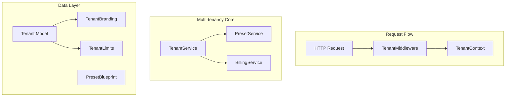

# Design Document: Multi-tenancy

> **🔄 Migration Notice:** This spec is being migrated from PHP/Laravel to Python/Django. All code examples, models, and implementation details are written for Django. The original Laravel implementation exists in the codebase and will be replaced.

## Overview

The Multi-tenancy system enables the LMS to serve multiple institutions from a single codebase with complete data isolation. It uses subdomain-based tenant identification, automatic query scoping, and preset blueprints for quick onboarding. This supports the SaaS expansion strategy targeting TVET colleges, driving schools, K-12 schools, and vocational training centers across Kenya.

## Architecture



## Components and Interfaces

### 1. Tenant Model

```python
from django.db import models

class Tenant(models.Model):
    name = models.CharField(max_length=255)
    subdomain = models.CharField(max_length=100, unique=True)
    admin_email = models.EmailField()
    subscription_tier = models.ForeignKey('SubscriptionTier', on_delete=models.SET_NULL, null=True)
    is_active = models.BooleanField(default=True)
    settings = models.JSONField(blank=True, null=True)
    activated_at = models.DateTimeField(blank=True, null=True)
    created_at = models.DateTimeField(auto_now_add=True)
    updated_at = models.DateTimeField(auto_now=True)
    deleted_at = models.DateTimeField(blank=True, null=True)

    class Meta:
        db_table = 'tenants'
        indexes = [
            models.Index(fields=['subdomain']),
            models.Index(fields=['is_active']),
        ]
```

### 2. TenantBranding Model

```python
class TenantBranding(models.Model):
    tenant = models.OneToOneField('Tenant', on_delete=models.CASCADE, related_name='branding')
    logo_path = models.CharField(max_length=500, blank=True, null=True)
    primary_color = models.CharField(max_length=7, default='#3B82F6')
    secondary_color = models.CharField(max_length=7, default='#1E40AF')
    institution_name = models.CharField(max_length=255, blank=True, null=True)
    tagline = models.CharField(max_length=255, blank=True, null=True)
    favicon_path = models.CharField(max_length=500, blank=True, null=True)
    created_at = models.DateTimeField(auto_now_add=True)
    updated_at = models.DateTimeField(auto_now=True)

    class Meta:
        db_table = 'tenant_brandings'
```

### 3. TenantLimits Model

```python
class TenantLimits(models.Model):
    tenant = models.OneToOneField('Tenant', on_delete=models.CASCADE, related_name='limits')
    max_students = models.PositiveIntegerField(default=100)
    max_storage_mb = models.PositiveIntegerField(default=5000)
    max_programs = models.PositiveIntegerField(default=10)
    current_students = models.PositiveIntegerField(default=0)
    current_storage_mb = models.PositiveIntegerField(default=0)
    current_programs = models.PositiveIntegerField(default=0)

    class Meta:
        db_table = 'tenant_limits'
```

### 4. PresetBlueprint Model

```python
class PresetBlueprint(models.Model):
    name = models.CharField(max_length=100)
    code = models.CharField(max_length=50, unique=True)
    description = models.TextField(blank=True, null=True)
    regulatory_body = models.CharField(max_length=100, blank=True, null=True)
    hierarchy_labels = models.JSONField()
    grading_config = models.JSONField()
    structure_rules = models.JSONField(blank=True, null=True)
    is_active = models.BooleanField(default=True)
    created_at = models.DateTimeField(auto_now_add=True)
    updated_at = models.DateTimeField(auto_now=True)

    class Meta:
        db_table = 'preset_blueprints'
        indexes = [
            models.Index(fields=['code']),
            models.Index(fields=['is_active']),
        ]
```


### 5. TenantContext (Thread-local)

```python
import threading

_tenant_context = threading.local()

class TenantContext:
    @staticmethod
    def set(tenant):
        _tenant_context.tenant = tenant

    @staticmethod
    def get():
        return getattr(_tenant_context, 'tenant', None)

    @staticmethod
    def id():
        tenant = TenantContext.get()
        return tenant.id if tenant else None

    @staticmethod
    def check():
        return TenantContext.get() is not None

    @staticmethod
    def clear():
        _tenant_context.tenant = None
```

### 6. TenantMiddleware

```python
from django.http import Http404

class TenantMiddleware:
    def __init__(self, get_response):
        self.get_response = get_response

    def __call__(self, request):
        subdomain = self.extract_subdomain(request)
        
        try:
            tenant = Tenant.objects.get(subdomain=subdomain, is_active=True)
            TenantContext.set(tenant)
        except Tenant.DoesNotExist:
            raise Http404("Tenant not found")
        
        response = self.get_response(request)
        TenantContext.clear()
        return response

    def extract_subdomain(self, request):
        host = request.get_host().split(':')[0]
        parts = host.split('.')
        return parts[0] if len(parts) > 2 else 'default'
```

### 7. TenantManager (Custom QuerySet)

```python
from django.db import models

class TenantManager(models.Manager):
    def get_queryset(self):
        qs = super().get_queryset()
        tenant_id = TenantContext.id()
        if tenant_id:
            qs = qs.filter(tenant_id=tenant_id)
        return qs

class TenantAwareModel(models.Model):
    tenant = models.ForeignKey('Tenant', on_delete=models.CASCADE)
    
    objects = TenantManager()
    all_objects = models.Manager()  # Bypass tenant filtering

    class Meta:
        abstract = True

    def save(self, *args, **kwargs):
        if not self.tenant_id:
            self.tenant_id = TenantContext.id()
        super().save(*args, **kwargs)
```

### 8. TenantService

```python
class TenantService:
    def __init__(self, preset_service, billing_service):
        self.preset_service = preset_service
        self.billing_service = billing_service

    def create(self, data: dict, preset_code: str) -> Tenant:
        tenant = Tenant.objects.create(**data)
        self.provision(tenant, preset_code)
        return tenant

    def provision(self, tenant: Tenant, preset_code: str = None) -> None:
        # Create admin user
        from django.contrib.auth import get_user_model
        User = get_user_model()
        admin = User.objects.create_user(
            email=tenant.admin_email,
            password=User.objects.make_random_password(),
            tenant=tenant,
            is_staff=True
        )
        
        # Create branding and limits
        TenantBranding.objects.create(tenant=tenant)
        TenantLimits.objects.create(tenant=tenant)
        
        # Copy preset blueprint if provided
        if preset_code:
            self.preset_service.copy_to_tenant(preset_code, tenant)

    def delete(self, tenant: Tenant) -> None:
        # Cascade delete handled by Django
        tenant.delete()

    def get_usage_stats(self, tenant: Tenant) -> dict:
        limits = tenant.limits
        return {
            'current_students': limits.current_students,
            'max_students': limits.max_students,
            'current_storage_mb': limits.current_storage_mb,
            'max_storage_mb': limits.max_storage_mb,
            'current_programs': limits.current_programs,
            'max_programs': limits.max_programs,
        }

    def check_limits(self, tenant: Tenant, resource: str) -> bool:
        limits = tenant.limits
        if resource == 'students':
            return limits.current_students < limits.max_students
        elif resource == 'storage':
            return limits.current_storage_mb < limits.max_storage_mb
        elif resource == 'programs':
            return limits.current_programs < limits.max_programs
        return True
```


### 9. PresetService

```python
class PresetService:
    def get_all(self):
        return PresetBlueprint.objects.filter(is_active=True)

    def get_by_code(self, code: str) -> PresetBlueprint:
        return PresetBlueprint.objects.get(code=code)

    def copy_to_tenant(self, preset_code: str, tenant: Tenant) -> 'AcademicBlueprint':
        preset = self.get_by_code(preset_code)
        return AcademicBlueprint.objects.create(
            tenant=tenant,
            name=preset.name,
            hierarchy_structure=preset.hierarchy_labels,
            grading_logic=preset.grading_config,
        )

    def seed_presets(self) -> None:
        presets = [
            {'code': 'tvet_cdacc', 'name': 'TVET CDACC Standard', 'regulatory_body': 'TVETA/CDACC',
             'hierarchy_labels': ['Qualification', 'Module', 'Unit of Competency', 'Element'],
             'grading_config': {'mode': 'cbet', 'scale': ['Competent', 'Not Yet Competent']}},
            {'code': 'nita_trade', 'name': 'NITA Trade Test', 'regulatory_body': 'NITA',
             'hierarchy_labels': ['Trade Area', 'Grade Level', 'Practical Project'],
             'grading_config': {'mode': 'visual_review'}},
            {'code': 'ntsa_driving', 'name': 'NTSA Driving Curriculum', 'regulatory_body': 'NTSA',
             'hierarchy_labels': ['License Class', 'Unit', 'Lesson Type'],
             'grading_config': {'mode': 'instructor_checklist'}},
            {'code': 'cbc_k12', 'name': 'CBC K-12 Standard', 'regulatory_body': 'KICD',
             'hierarchy_labels': ['Grade', 'Learning Area', 'Strand', 'Sub-strand'],
             'grading_config': {'mode': 'rubric'}},
            {'code': 'cct_theology', 'name': 'CCT Theology Standard', 'regulatory_body': 'Internal',
             'hierarchy_labels': ['Program', 'Year', 'Unit', 'Session'],
             'grading_config': {'mode': 'summative', 'pass_mark': 40}},
        ]
        for preset_data in presets:
            PresetBlueprint.objects.update_or_create(code=preset_data['code'], defaults=preset_data)
```

## Data Models

### Database Schema

```sql
CREATE TABLE tenants (
    id BIGSERIAL PRIMARY KEY,
    name VARCHAR(255) NOT NULL,
    subdomain VARCHAR(100) NOT NULL UNIQUE,
    admin_email VARCHAR(255) NOT NULL,
    subscription_tier_id BIGINT NULL,
    is_active BOOLEAN DEFAULT TRUE,
    settings JSONB NULL,
    activated_at TIMESTAMP NULL,
    created_at TIMESTAMP DEFAULT CURRENT_TIMESTAMP,
    updated_at TIMESTAMP DEFAULT CURRENT_TIMESTAMP,
    deleted_at TIMESTAMP NULL
);

CREATE TABLE tenant_brandings (
    id BIGSERIAL PRIMARY KEY,
    tenant_id BIGINT NOT NULL UNIQUE REFERENCES tenants(id) ON DELETE CASCADE,
    logo_path VARCHAR(500) NULL,
    primary_color VARCHAR(7) DEFAULT '#3B82F6',
    secondary_color VARCHAR(7) DEFAULT '#1E40AF',
    institution_name VARCHAR(255) NULL,
    tagline VARCHAR(255) NULL,
    favicon_path VARCHAR(500) NULL,
    created_at TIMESTAMP DEFAULT CURRENT_TIMESTAMP,
    updated_at TIMESTAMP DEFAULT CURRENT_TIMESTAMP
);

CREATE TABLE tenant_limits (
    id BIGSERIAL PRIMARY KEY,
    tenant_id BIGINT NOT NULL UNIQUE REFERENCES tenants(id) ON DELETE CASCADE,
    max_students INTEGER DEFAULT 100,
    max_storage_mb INTEGER DEFAULT 5000,
    max_programs INTEGER DEFAULT 10,
    current_students INTEGER DEFAULT 0,
    current_storage_mb INTEGER DEFAULT 0,
    current_programs INTEGER DEFAULT 0
);

CREATE TABLE preset_blueprints (
    id BIGSERIAL PRIMARY KEY,
    name VARCHAR(100) NOT NULL,
    code VARCHAR(50) NOT NULL UNIQUE,
    description TEXT NULL,
    regulatory_body VARCHAR(100) NULL,
    hierarchy_labels JSONB NOT NULL,
    grading_config JSONB NOT NULL,
    structure_rules JSONB NULL,
    is_active BOOLEAN DEFAULT TRUE,
    created_at TIMESTAMP DEFAULT CURRENT_TIMESTAMP,
    updated_at TIMESTAMP DEFAULT CURRENT_TIMESTAMP
);

-- Add tenant_id to existing tables
ALTER TABLE users ADD COLUMN tenant_id BIGINT REFERENCES tenants(id);
ALTER TABLE academic_blueprints ADD COLUMN tenant_id BIGINT REFERENCES tenants(id);
ALTER TABLE curriculum_nodes ADD COLUMN tenant_id BIGINT REFERENCES tenants(id);
ALTER TABLE enrollments ADD COLUMN tenant_id BIGINT REFERENCES tenants(id);
```


## Correctness Properties

*A property is a characteristic or behavior that should hold true across all valid executions of a system.*

### Property 1: Tenant Creation with Admin
*For any* tenant registration, a Tenant record SHALL be created with unique subdomain, and a User with admin role SHALL be provisioned for that tenant.
**Validates: Requirements 1.1, 1.2**

### Property 2: Preset Blueprint Copying
*For any* preset selection during tenant setup, an AcademicBlueprint SHALL be created for the tenant with configuration matching the preset.
**Validates: Requirements 1.3, 5.2**

### Property 3: Query Scoping
*For any* database query on a tenant-scoped model, the query SHALL automatically include `WHERE tenant_id = current_tenant_id`.
**Validates: Requirements 2.1**

### Property 4: Cross-Tenant Access Denial
*For any* attempt to access data belonging to a different tenant, access SHALL be denied and the attempt SHALL be logged.
**Validates: Requirements 2.2**

### Property 5: File Storage Isolation
*For any* file upload, the storage path SHALL include the tenant identifier (e.g., `tenants/{tenant_id}/...`).
**Validates: Requirements 2.3**

### Property 6: Tenant Deletion Cascade
*For any* tenant deletion, all associated data (users, blueprints, nodes, enrollments, files) SHALL be removed.
**Validates: Requirements 2.4**

### Property 7: Subdomain Identification
*For any* HTTP request, the tenant SHALL be identified from the subdomain; unknown subdomains SHALL return 404; identified tenants SHALL have context set for the request lifecycle.
**Validates: Requirements 3.1, 3.2, 3.3**

### Property 8: Branding Configuration
*For any* tenant branding update, the settings (logo, colors, name) SHALL be persisted; missing branding SHALL fall back to defaults.
**Validates: Requirements 4.1, 4.3**

### Property 9: Preset Copy Isolation
*For any* preset update, existing tenant blueprint copies SHALL remain unchanged; tenant blueprint modifications SHALL not affect the preset.
**Validates: Requirements 5.3, 5.4**

### Property 10-12: Limit Assignment, Limit Enforcement, Usage Statistics
(See requirements 6.1-6.4)

## Testing Strategy

### Property-Based Testing Library
We will use **Hypothesis** for property-based tests.

```python
from hypothesis import strategies as st

subdomain_strategy = st.text(
    alphabet=st.sampled_from('abcdefghijklmnopqrstuvwxyz0123456789-'),
    min_size=3, max_size=20
).filter(lambda s: not s.startswith('-') and not s.endswith('-'))

preset_strategy = st.sampled_from(['tvet_cdacc', 'nita_trade', 'ntsa_driving', 'cbc_k12', 'cct_theology'])
```
