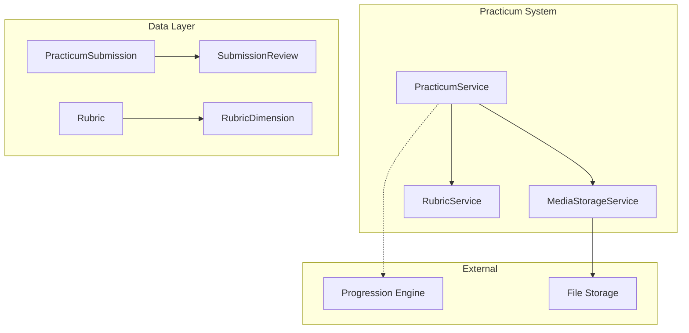

# Design Document: Practicum System

## Overview

The Practicum System handles media-based practical assessments. Students submit audio/video/image evidence, lecturers grade against rubrics, and the system manages the review workflow. It integrates with the Progression Engine to unlock nodes upon approval.

## Architecture



## Components and Interfaces

### 1. PracticumSubmission Model

```php
namespace App\Models;

class PracticumSubmission extends Model
{
    protected $fillable = [
        'enrollment_id',
        'node_id',
        'version',
        'status',
        'file_path',
        'file_type',
        'file_size',
        'duration_seconds',
        'metadata',
        'submitted_at',
    ];

    protected $casts = [
        'version' => 'integer',
        'file_size' => 'integer',
        'duration_seconds' => 'integer',
        'metadata' => 'array',
        'submitted_at' => 'datetime',
    ];

    public function enrollment(): BelongsTo;
    public function node(): BelongsTo;
    public function reviews(): HasMany;
    public function latestReview(): HasOne;
    public function getSignedUrl(): string;
}
```

### 2. Rubric Model

```php
namespace App\Models;

class Rubric extends Model
{
    protected $fillable = [
        'name',
        'description',
        'dimensions',
        'max_score',
    ];

    protected $casts = [
        'dimensions' => 'array',
        'max_score' => 'integer',
    ];

    public function calculateScore(array $dimensionScores): float;
}
```

### 3. SubmissionReview Model

```php
namespace App\Models;

class SubmissionReview extends Model
{
    protected $fillable = [
        'submission_id',
        'reviewer_id',
        'status',
        'dimension_scores',
        'total_score',
        'comments',
        'reviewed_at',
    ];

    protected $casts = [
        'dimension_scores' => 'array',
        'total_score' => 'float',
        'reviewed_at' => 'datetime',
    ];

    public function submission(): BelongsTo;
    public function reviewer(): BelongsTo;
}
```

### 4. PracticumService

```php
namespace App\Services;

class PracticumService
{
    public function __construct(
        private MediaStorageService $storage,
        private RubricService $rubricService,
        private ProgressionEngine $progressionEngine
    ) {}

    public function createSubmission(
        Enrollment $enrollment,
        CurriculumNode $node,
        UploadedFile $file
    ): PracticumSubmission;
    
    public function validateFile(UploadedFile $file, array $requirements): ValidationResult;
    
    public function reviewSubmission(
        PracticumSubmission $submission,
        User $reviewer,
        string $status,
        array $dimensionScores,
        ?string $comments
    ): SubmissionReview;
    
    public function getSubmissionHistory(Enrollment $enrollment, CurriculumNode $node): Collection;
    
    public function resubmit(PracticumSubmission $previous, UploadedFile $file): PracticumSubmission;
}
```

### 5. MediaStorageService

```php
namespace App\Services;

class MediaStorageService
{
    public function store(UploadedFile $file, string $path): string;
    public function getSignedUrl(string $path, int $expiresInMinutes = 60): string;
    public function delete(string $path): bool;
    public function validateAccess(User $user, string $path): bool;
}
```

### 6. RubricService

```php
namespace App\Services;

class RubricService
{
    public function calculateScore(Rubric $rubric, array $dimensionScores): float;
    public function validateDimensionScores(Rubric $rubric, array $scores): bool;
}
```

## Data Models

### Database Schema

```sql
CREATE TABLE rubrics (
    id BIGINT UNSIGNED AUTO_INCREMENT PRIMARY KEY,
    name VARCHAR(255) NOT NULL,
    description TEXT NULL,
    dimensions JSON NOT NULL,
    max_score INT UNSIGNED NOT NULL,
    created_at TIMESTAMP DEFAULT CURRENT_TIMESTAMP,
    updated_at TIMESTAMP DEFAULT CURRENT_TIMESTAMP ON UPDATE CURRENT_TIMESTAMP
);

CREATE TABLE practicum_submissions (
    id BIGINT UNSIGNED AUTO_INCREMENT PRIMARY KEY,
    enrollment_id BIGINT UNSIGNED NOT NULL,
    node_id BIGINT UNSIGNED NOT NULL,
    version INT UNSIGNED DEFAULT 1,
    status ENUM('pending', 'approved', 'revision_required', 'rejected') DEFAULT 'pending',
    file_path VARCHAR(500) NOT NULL,
    file_type VARCHAR(50) NOT NULL,
    file_size BIGINT UNSIGNED NOT NULL,
    duration_seconds INT UNSIGNED NULL,
    metadata JSON NULL,
    submitted_at TIMESTAMP NOT NULL,
    created_at TIMESTAMP DEFAULT CURRENT_TIMESTAMP,
    
    FOREIGN KEY (enrollment_id) REFERENCES enrollments(id) ON DELETE CASCADE,
    FOREIGN KEY (node_id) REFERENCES curriculum_nodes(id) ON DELETE CASCADE,
    
    INDEX idx_enrollment_node (enrollment_id, node_id),
    INDEX idx_status (status)
);

CREATE TABLE submission_reviews (
    id BIGINT UNSIGNED AUTO_INCREMENT PRIMARY KEY,
    submission_id BIGINT UNSIGNED NOT NULL,
    reviewer_id BIGINT UNSIGNED NOT NULL,
    status ENUM('approved', 'revision_required', 'rejected') NOT NULL,
    dimension_scores JSON NULL,
    total_score DECIMAL(5,2) NULL,
    comments TEXT NULL,
    reviewed_at TIMESTAMP NOT NULL,
    created_at TIMESTAMP DEFAULT CURRENT_TIMESTAMP,
    
    FOREIGN KEY (submission_id) REFERENCES practicum_submissions(id) ON DELETE CASCADE,
    FOREIGN KEY (reviewer_id) REFERENCES users(id) ON DELETE CASCADE,
    
    INDEX idx_submission (submission_id)
);
```

### JSON Schema: Rubric Dimensions

```json
{
    "dimensions": [
        {
            "name": "Introduction",
            "weight": 0.2,
            "max_score": 10,
            "levels": [
                { "score": 10, "description": "Excellent - Clear, engaging opening" },
                { "score": 7, "description": "Good - Adequate introduction" },
                { "score": 4, "description": "Fair - Weak introduction" },
                { "score": 0, "description": "Poor - No clear introduction" }
            ]
        },
        {
            "name": "Body",
            "weight": 0.5,
            "max_score": 10
        },
        {
            "name": "Conclusion",
            "weight": 0.3,
            "max_score": 10
        }
    ]
}
```

### JSON Schema: Practicum Completion Rules

```json
{
    "type": "practicum",
    "evidence_types": ["audio", "video"],
    "max_file_size_mb": 50,
    "max_duration_seconds": 600,
    "rubric_id": 1,
    "allow_resubmission": true
}
```


## Correctness Properties

*A property is a characteristic or behavior that should hold true across all valid executions of a system-essentially, a formal statement about what the system should do. Properties serve as the bridge between human-readable specifications and machine-verifiable correctness guarantees.*

### Property 1: Practicum Blocks Completion Without Submission
*For any* node with completion_rules.type "practicum", the node SHALL NOT be marked complete until an approved submission exists.
**Validates: Requirements 1.1**

### Property 2: Practicum Configuration Storage
*For any* practicum configuration with evidence_types, file limits, and rubric_id, saving and retrieving SHALL return identical configuration values.
**Validates: Requirements 1.2, 1.3, 1.4**

### Property 3: File Validation Against Config
*For any* file upload, the system SHALL reject files that don't match allowed evidence_types OR exceed max_file_size_mb OR exceed max_duration_seconds.
**Validates: Requirements 2.3, 2.4**

### Property 4: Submission Record Creation
*For any* successful file upload, a PracticumSubmission record SHALL exist with correct file_path, file_type, and file_size.
**Validates: Requirements 2.5**

### Property 5: Rubric Score Calculation
*For any* set of dimension scores and a rubric with weights, the total score SHALL equal the weighted sum of dimension scores.
**Validates: Requirements 3.2, 3.4**

### Property 6: Review Persistence
*For any* submitted review, the SubmissionReview record SHALL contain dimension_scores, total_score, comments, and reviewer_id.
**Validates: Requirements 3.3**

### Property 7: Default Pending Status
*For any* newly created submission, the status SHALL be "pending".
**Validates: Requirements 4.1**

### Property 8: Review Status Transitions
*For any* review action, the submission status SHALL transition correctly: approve→"approved", revision→"revision_required", reject→"rejected".
**Validates: Requirements 4.2, 4.3, 4.4**

### Property 9: Approval Triggers Completion
*For any* submission that transitions to "approved", the associated node SHALL be marked complete for that enrollment.
**Validates: Requirements 4.2**

### Property 10: Resubmission Creates New Version
*For any* resubmission, a new PracticumSubmission SHALL be created with version incremented and status reset to "pending".
**Validates: Requirements 4.5**

### Property 11: Submission History Ordering
*For any* query of submission history, results SHALL be ordered by submitted_at in chronological order.
**Validates: Requirements 5.2**

### Property 12: Secure Media Storage
*For any* stored file, access SHALL require valid permissions, and URLs SHALL be signed with expiration.
**Validates: Requirements 6.1, 6.2, 6.3**

## Error Handling

- **InvalidFileTypeException**: Thrown when file type doesn't match allowed evidence_types
- **FileSizeExceededException**: Thrown when file exceeds max_file_size_mb
- **DurationExceededException**: Thrown when media duration exceeds max_duration_seconds
- **RubricNotFoundException**: Thrown when rubric_id doesn't exist
- **UnauthorizedAccessException**: Thrown when user lacks permission to view file

## Testing Strategy

### Property-Based Testing Library
PHPUnit with eris/eris for property-based tests.

### Test Data Generators
```php
// File upload generator
$fileGen = Generator::tuple(
    Generator::elements(['audio/mp3', 'video/mp4', 'image/jpeg']),
    Generator::int(1, 100 * 1024 * 1024),  // size in bytes
    Generator::int(0, 3600)  // duration in seconds
);

// Dimension scores generator
$scoresGen = Generator::associativeArray([
    'introduction' => Generator::int(0, 10),
    'body' => Generator::int(0, 10),
    'conclusion' => Generator::int(0, 10),
]);

// Review status generator
$statusGen = Generator::elements(['approved', 'revision_required', 'rejected']);
```
