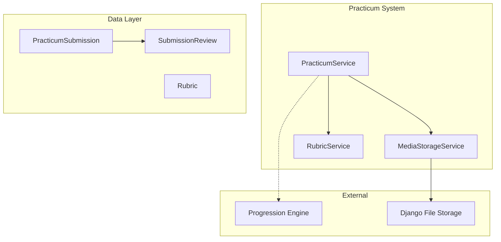

# Design Document: Practicum System

> **🔄 Migration Notice:** This spec is being migrated from PHP/Laravel to Python/Django. All code examples, models, and implementation details are written for Django. The original Laravel implementation exists in the codebase and will be replaced.

## Overview

The Practicum System handles media-based practical assessments. Students submit audio/video/image evidence, lecturers grade against rubrics, and the system manages the review workflow. It integrates with the Progression Engine to unlock nodes upon approval.

## Architecture



## Components and Interfaces

### 1. PracticumSubmission Model

```python
from django.db import models

class PracticumSubmission(models.Model):
    STATUS_CHOICES = [
        ('pending', 'Pending'),
        ('approved', 'Approved'),
        ('revision_required', 'Revision Required'),
        ('rejected', 'Rejected'),
    ]

    enrollment = models.ForeignKey('Enrollment', on_delete=models.CASCADE, related_name='practicum_submissions')
    node = models.ForeignKey('CurriculumNode', on_delete=models.CASCADE, related_name='practicum_submissions')
    version = models.PositiveIntegerField(default=1)
    status = models.CharField(max_length=20, choices=STATUS_CHOICES, default='pending')
    file_path = models.CharField(max_length=500)
    file_type = models.CharField(max_length=50)
    file_size = models.BigIntegerField()
    duration_seconds = models.PositiveIntegerField(blank=True, null=True)
    metadata = models.JSONField(blank=True, null=True)
    submitted_at = models.DateTimeField()
    created_at = models.DateTimeField(auto_now_add=True)

    class Meta:
        db_table = 'practicum_submissions'
        indexes = [
            models.Index(fields=['enrollment', 'node']),
            models.Index(fields=['status']),
        ]

    def get_signed_url(self) -> str:
        from django.core.signing import TimestampSigner
        signer = TimestampSigner()
        return signer.sign(self.file_path)
```

### 2. Rubric Model

```python
class Rubric(models.Model):
    name = models.CharField(max_length=255)
    description = models.TextField(blank=True, null=True)
    dimensions = models.JSONField()  # [{"name": "...", "weight": 0.3, "max_score": 10}]
    max_score = models.PositiveIntegerField()
    created_at = models.DateTimeField(auto_now_add=True)
    updated_at = models.DateTimeField(auto_now=True)

    class Meta:
        db_table = 'rubrics'

    def calculate_score(self, dimension_scores: dict) -> float:
        total = 0.0
        for dim in self.dimensions:
            score = dimension_scores.get(dim['name'], 0)
            total += score * dim['weight']
        return total
```

### 3. SubmissionReview Model

```python
class SubmissionReview(models.Model):
    STATUS_CHOICES = [
        ('approved', 'Approved'),
        ('revision_required', 'Revision Required'),
        ('rejected', 'Rejected'),
    ]

    submission = models.ForeignKey('PracticumSubmission', on_delete=models.CASCADE, related_name='reviews')
    reviewer = models.ForeignKey('User', on_delete=models.CASCADE, related_name='submission_reviews')
    status = models.CharField(max_length=20, choices=STATUS_CHOICES)
    dimension_scores = models.JSONField(blank=True, null=True)
    total_score = models.DecimalField(max_digits=5, decimal_places=2, blank=True, null=True)
    comments = models.TextField(blank=True, null=True)
    reviewed_at = models.DateTimeField()
    created_at = models.DateTimeField(auto_now_add=True)

    class Meta:
        db_table = 'submission_reviews'
        indexes = [models.Index(fields=['submission'])]
```


### 4. PracticumService

```python
from django.utils import timezone
from django.core.files.uploadedfile import UploadedFile

class PracticumService:
    def __init__(self, storage_service, rubric_service, progression_engine):
        self.storage = storage_service
        self.rubric_service = rubric_service
        self.progression_engine = progression_engine

    def create_submission(self, enrollment, node, file: UploadedFile) -> PracticumSubmission:
        validation = self.validate_file(file, node.completion_rules)
        if not validation['valid']:
            raise InvalidFileException(validation['errors'])
        
        file_path = self.storage.store(file, f"practicum/{enrollment.id}/{node.id}/")
        
        return PracticumSubmission.objects.create(
            enrollment=enrollment,
            node=node,
            file_path=file_path,
            file_type=file.content_type,
            file_size=file.size,
            submitted_at=timezone.now()
        )

    def validate_file(self, file: UploadedFile, requirements: dict) -> dict:
        errors = []
        evidence_types = requirements.get('evidence_types', [])
        max_size = requirements.get('max_file_size_mb', 50) * 1024 * 1024
        max_duration = requirements.get('max_duration_seconds')
        
        # Check file type
        file_type = file.content_type.split('/')[0]
        if evidence_types and file_type not in evidence_types:
            errors.append(f"File type {file_type} not allowed")
        
        # Check file size
        if file.size > max_size:
            errors.append(f"File size exceeds {max_size / 1024 / 1024}MB limit")
        
        return {'valid': len(errors) == 0, 'errors': errors}

    def review_submission(self, submission, reviewer, status: str, dimension_scores: dict = None, comments: str = None) -> SubmissionReview:
        total_score = None
        if dimension_scores and submission.node.completion_rules.get('rubric_id'):
            rubric = Rubric.objects.get(id=submission.node.completion_rules['rubric_id'])
            total_score = self.rubric_service.calculate_score(rubric, dimension_scores)
        
        review = SubmissionReview.objects.create(
            submission=submission,
            reviewer=reviewer,
            status=status,
            dimension_scores=dimension_scores,
            total_score=total_score,
            comments=comments,
            reviewed_at=timezone.now()
        )
        
        submission.status = status
        submission.save()
        
        if status == 'approved':
            self.progression_engine.mark_complete(submission.enrollment, submission.node, 'upload')
        
        return review

    def get_submission_history(self, enrollment, node):
        return PracticumSubmission.objects.filter(
            enrollment=enrollment, node=node
        ).order_by('submitted_at')

    def resubmit(self, previous: PracticumSubmission, file: UploadedFile) -> PracticumSubmission:
        submission = self.create_submission(previous.enrollment, previous.node, file)
        submission.version = previous.version + 1
        submission.save()
        return submission
```

### 5. MediaStorageService

```python
from django.core.files.storage import default_storage
from django.core.signing import TimestampSigner

class MediaStorageService:
    def store(self, file: UploadedFile, path: str) -> str:
        full_path = default_storage.save(path + file.name, file)
        return full_path

    def get_signed_url(self, path: str, expires_in_minutes: int = 60) -> str:
        signer = TimestampSigner()
        return signer.sign(path)

    def delete(self, path: str) -> bool:
        return default_storage.delete(path)

    def validate_access(self, user, path: str) -> bool:
        # Check if user owns the submission
        return True
```

### 6. RubricService

```python
class RubricService:
    def calculate_score(self, rubric: Rubric, dimension_scores: dict) -> float:
        return rubric.calculate_score(dimension_scores)

    def validate_dimension_scores(self, rubric: Rubric, scores: dict) -> bool:
        required_dims = {d['name'] for d in rubric.dimensions}
        provided_dims = set(scores.keys())
        return required_dims == provided_dims
```


## Data Models

### Database Schema

```sql
CREATE TABLE rubrics (
    id BIGSERIAL PRIMARY KEY,
    name VARCHAR(255) NOT NULL,
    description TEXT NULL,
    dimensions JSONB NOT NULL,
    max_score INTEGER NOT NULL,
    created_at TIMESTAMP DEFAULT CURRENT_TIMESTAMP,
    updated_at TIMESTAMP DEFAULT CURRENT_TIMESTAMP
);

CREATE TABLE practicum_submissions (
    id BIGSERIAL PRIMARY KEY,
    enrollment_id BIGINT NOT NULL REFERENCES enrollments(id) ON DELETE CASCADE,
    node_id BIGINT NOT NULL REFERENCES curriculum_nodes(id) ON DELETE CASCADE,
    version INTEGER DEFAULT 1,
    status VARCHAR(20) DEFAULT 'pending',
    file_path VARCHAR(500) NOT NULL,
    file_type VARCHAR(50) NOT NULL,
    file_size BIGINT NOT NULL,
    duration_seconds INTEGER NULL,
    metadata JSONB NULL,
    submitted_at TIMESTAMP NOT NULL,
    created_at TIMESTAMP DEFAULT CURRENT_TIMESTAMP
);

CREATE TABLE submission_reviews (
    id BIGSERIAL PRIMARY KEY,
    submission_id BIGINT NOT NULL REFERENCES practicum_submissions(id) ON DELETE CASCADE,
    reviewer_id BIGINT NOT NULL REFERENCES users(id) ON DELETE CASCADE,
    status VARCHAR(20) NOT NULL,
    dimension_scores JSONB NULL,
    total_score DECIMAL(5,2) NULL,
    comments TEXT NULL,
    reviewed_at TIMESTAMP NOT NULL,
    created_at TIMESTAMP DEFAULT CURRENT_TIMESTAMP
);
```

## Correctness Properties

### Property 1: Practicum Blocks Completion Without Submission
*For any* node with completion_rules.type "practicum", the node SHALL NOT be marked complete until an approved submission exists.
**Validates: Requirements 1.1**

### Property 2: Practicum Configuration Storage
*For any* practicum configuration with evidence_types, file limits, and rubric_id, saving and retrieving SHALL return identical configuration values.
**Validates: Requirements 1.2, 1.3, 1.4**

### Property 3: File Validation Against Config
*For any* file upload, the system SHALL reject files that don't match allowed evidence_types OR exceed max_file_size_mb OR exceed max_duration_seconds.
**Validates: Requirements 2.3, 2.4**

### Property 4-12: Submission Record, Rubric Score, Review Persistence, Status Transitions, etc.
(See requirements 2.5, 3.2-3.4, 4.1-4.5, 5.1-5.3, 6.1-6.3)

## Testing Strategy

### Property-Based Testing Library
We will use **Hypothesis** for property-based tests.

```python
from hypothesis import strategies as st

file_strategy = st.fixed_dictionaries({
    'content_type': st.sampled_from(['audio/mp3', 'video/mp4', 'image/jpeg']),
    'size': st.integers(min_value=1, max_value=100 * 1024 * 1024),
    'duration': st.integers(min_value=0, max_value=3600)
})

dimension_scores_strategy = st.dictionaries(
    keys=st.sampled_from(['introduction', 'body', 'conclusion']),
    values=st.integers(min_value=0, max_value=10)
)
```
