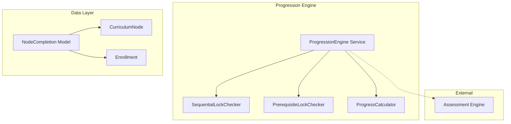

# Design Document: Progression Engine

> **🔄 Migration Notice:** This spec is being migrated from PHP/Laravel to Python/Django. All code examples, models, and implementation details are written for Django. The original Laravel implementation exists in the codebase and will be replaced.

## Overview

The Progression Engine controls student access to curriculum content through sequential locking and prerequisite enforcement. It tracks node completions, calculates progress percentages, and provides unlock status for UI rendering. The engine integrates with the Blueprint Engine (for progression_rules) and Assessment Engine (for quiz-based completion).

## Architecture



## Components and Interfaces

### 1. NodeCompletion Model

```python
from django.db import models

class NodeCompletion(models.Model):
    COMPLETION_TYPES = [
        ('view', 'View'),
        ('quiz_pass', 'Quiz Pass'),
        ('upload', 'Upload'),
        ('manual', 'Manual'),
    ]

    enrollment = models.ForeignKey('Enrollment', on_delete=models.CASCADE, related_name='completions')
    node = models.ForeignKey('CurriculumNode', on_delete=models.CASCADE, related_name='completions')
    completed_at = models.DateTimeField()
    completion_type = models.CharField(max_length=20, choices=COMPLETION_TYPES)
    metadata = models.JSONField(blank=True, null=True)
    created_at = models.DateTimeField(auto_now_add=True)

    class Meta:
        db_table = 'node_completions'
        unique_together = ['enrollment', 'node']
        indexes = [
            models.Index(fields=['enrollment']),
            models.Index(fields=['node']),
        ]
```

### 2. AccessResult DTO

```python
from dataclasses import dataclass
from typing import Optional, List

@dataclass
class AccessResult:
    can_access: bool
    status: str  # 'unlocked', 'locked', 'completed'
    lock_reason: Optional[str] = None  # 'sequential', 'prerequisite'
    blocking_nodes: Optional[List[int]] = None
```

### 3. ProgressionEngine Service

```python
from django.utils import timezone
from typing import Optional

class ProgressionEngine:
    def __init__(self, sequential_checker, prerequisite_checker, progress_calculator):
        self.sequential_checker = sequential_checker
        self.prerequisite_checker = prerequisite_checker
        self.progress_calculator = progress_calculator

    def can_access(self, enrollment, node) -> AccessResult:
        # Check if already completed
        if NodeCompletion.objects.filter(enrollment=enrollment, node=node).exists():
            return AccessResult(can_access=True, status='completed')
        
        completed_ids = set(NodeCompletion.objects.filter(
            enrollment=enrollment
        ).values_list('node_id', flat=True))
        
        # Check sequential lock
        progression_rules = enrollment.program.blueprint.progression_rules or {}
        if progression_rules.get('sequential', True):
            seq_result = self.sequential_checker.is_unlocked(enrollment, node, completed_ids)
            if not seq_result.can_access:
                return seq_result
        
        # Check prerequisites
        prereq_result = self.prerequisite_checker.are_prerequisites_met(node, completed_ids)
        if not prereq_result.can_access:
            return prereq_result
        
        return AccessResult(can_access=True, status='unlocked')

    def mark_complete(self, enrollment, node, completion_type: str) -> NodeCompletion:
        completion, created = NodeCompletion.objects.get_or_create(
            enrollment=enrollment,
            node=node,
            defaults={
                'completed_at': timezone.now(),
                'completion_type': completion_type
            }
        )
        
        # Check for program completion
        if self.check_program_completion(enrollment):
            enrollment.status = 'completed'
            enrollment.save()
        
        return completion

    def get_unlock_status(self, enrollment):
        nodes = enrollment.program.nodes.all()
        completed_ids = set(NodeCompletion.objects.filter(
            enrollment=enrollment
        ).values_list('node_id', flat=True))
        
        statuses = []
        for node in nodes:
            if node.id in completed_ids:
                statuses.append({'node_id': node.id, 'status': 'completed'})
            else:
                result = self.can_access(enrollment, node)
                statuses.append({
                    'node_id': node.id,
                    'status': result.status,
                    'lock_reason': result.lock_reason,
                    'blocking_nodes': result.blocking_nodes
                })
        return statuses

    def calculate_progress(self, enrollment, subtree_root=None) -> float:
        return self.progress_calculator.calculate(enrollment, subtree_root)

    def check_program_completion(self, enrollment) -> bool:
        return self.calculate_progress(enrollment) >= 100.0
```


### 4. SequentialLockChecker

```python
class SequentialLockChecker:
    def is_unlocked(self, enrollment, node, completed_ids: set) -> AccessResult:
        # Get siblings ordered by position
        siblings = CurriculumNode.objects.filter(
            program=node.program,
            parent=node.parent
        ).order_by('position')
        
        for sibling in siblings:
            if sibling.id == node.id:
                return AccessResult(can_access=True, status='unlocked')
            if sibling.id not in completed_ids:
                return AccessResult(
                    can_access=False,
                    status='locked',
                    lock_reason='sequential',
                    blocking_nodes=[sibling.id]
                )
        
        return AccessResult(can_access=True, status='unlocked')

    def get_first_uncompleted_sibling(self, node, completed_ids: set):
        siblings = CurriculumNode.objects.filter(
            program=node.program,
            parent=node.parent
        ).order_by('position')
        
        for sibling in siblings:
            if sibling.id not in completed_ids:
                return sibling
        return None
```

### 5. PrerequisiteLockChecker

```python
class PrerequisiteLockChecker:
    def are_prerequisites_met(self, node, completed_ids: set) -> AccessResult:
        prerequisites = node.completion_rules.get('prerequisites', []) if node.completion_rules else []
        
        incomplete = [p for p in prerequisites if p not in completed_ids]
        
        if incomplete:
            return AccessResult(
                can_access=False,
                status='locked',
                lock_reason='prerequisite',
                blocking_nodes=incomplete
            )
        
        return AccessResult(can_access=True, status='unlocked')

    def get_incomplete_prerequisites(self, node, completed_ids: set):
        prerequisites = node.completion_rules.get('prerequisites', []) if node.completion_rules else []
        return [p for p in prerequisites if p not in completed_ids]
```

### 6. ProgressCalculator

```python
class ProgressCalculator:
    def calculate(self, enrollment, subtree_root=None) -> float:
        if subtree_root:
            all_nodes = self.get_subtree_nodes(subtree_root)
        else:
            all_nodes = enrollment.program.nodes.all()
        
        completable_nodes = self.get_completable_nodes(all_nodes)
        if not completable_nodes:
            return 100.0
        
        completed_count = NodeCompletion.objects.filter(
            enrollment=enrollment,
            node__in=completable_nodes
        ).count()
        
        return (completed_count / len(completable_nodes)) * 100

    def get_completable_nodes(self, nodes):
        # Filter out container nodes (nodes with children that aren't completable)
        return [n for n in nodes if n.completion_rules and n.completion_rules.get('is_completable', True)]

    def get_subtree_nodes(self, root):
        nodes = [root]
        for child in root.children.all():
            nodes.extend(self.get_subtree_nodes(child))
        return nodes
```


## Data Models

### Database Schema

```sql
CREATE TABLE node_completions (
    id BIGSERIAL PRIMARY KEY,
    enrollment_id BIGINT NOT NULL REFERENCES enrollments(id) ON DELETE CASCADE,
    node_id BIGINT NOT NULL REFERENCES curriculum_nodes(id) ON DELETE CASCADE,
    completed_at TIMESTAMP NOT NULL,
    completion_type VARCHAR(20) NOT NULL,
    metadata JSONB NULL,
    created_at TIMESTAMP DEFAULT CURRENT_TIMESTAMP,
    
    UNIQUE (enrollment_id, node_id)
);
CREATE INDEX idx_completions_enrollment ON node_completions(enrollment_id);
CREATE INDEX idx_completions_node ON node_completions(node_id);
```

### JSON Schema: Completion Rules (on CurriculumNode)

```json
{
    "type": "quiz_pass",
    "quiz_id": 123,
    "min_score": 40,
    "prerequisites": [45, 46, 47],
    "is_completable": true
}
```

### JSON Schema: Progression Rules (on Blueprint)

```json
{
    "sequential": true,
    "allow_skip": false,
    "auto_complete_containers": true
}
```

## Correctness Properties

### Property 1: Sequential Unlock Progression
*For any* set of sibling nodes with sequential locking enabled, only the first uncompleted node (by position) SHALL be unlocked; completing it SHALL unlock the next sibling.
**Validates: Requirements 1.1, 1.2**

### Property 2: Sequential Lock Denial
*For any* locked node under sequential rules, access SHALL be denied with the blocking node identified.
**Validates: Requirements 1.3**

### Property 3: Sequential Disabled Allows All
*For any* program with sequential locking disabled, all published nodes SHALL be accessible regardless of completion order.
**Validates: Requirements 1.4**

### Property 4: Prerequisite Unlock
*For any* node with prerequisites, the node SHALL be unlocked if and only if ALL prerequisite nodes are completed.
**Validates: Requirements 2.1, 2.2, 2.3**

### Property 5: Prerequisite Re-lock
*For any* node that was unlocked via prerequisites, if any prerequisite becomes un-completed, the node SHALL become locked again.
**Validates: Requirements 2.4**

### Property 6: Completion Record Creation
*For any* node marked complete, a completion record SHALL exist with a non-null timestamp and completion_type.
**Validates: Requirements 3.1**

### Property 7: Completion Type Triggers
*For any* node with completion_rules.type, completion SHALL only occur when the corresponding trigger fires (view, quiz_pass, or upload).
**Validates: Requirements 3.2, 3.3, 3.4**

### Property 8: Completion Idempotency
*For any* node marked complete multiple times, exactly one completion record SHALL exist.
**Validates: Requirements 3.5**

### Property 9-15: Progress Calculation, Subtree Scoping, Container Exclusion, Program Completion, Unlock Status, Lock Reason, Completion Rules Validation
(See requirements 4.1-4.4, 5.1-5.2, 6.1-6.3)

## Testing Strategy

### Property-Based Testing Library
We will use **Hypothesis** for property-based tests.

```python
from hypothesis import strategies as st

# Sibling nodes generator (ordered by position)
@st.composite
def siblings_strategy(draw):
    count = draw(st.integers(min_value=1, max_value=10))
    completed = draw(st.lists(st.booleans(), min_size=count, max_size=count))
    return [(i, completed[i]) for i in range(count)]

completion_type_strategy = st.sampled_from(['view', 'quiz_pass', 'upload', 'manual'])
```
