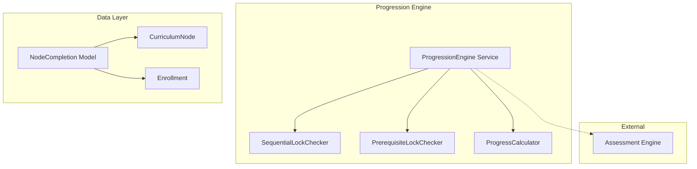

# Design Document: Progression Engine

## Overview

The Progression Engine controls student access to curriculum content through sequential locking and prerequisite enforcement. It tracks node completions, calculates progress percentages, and provides unlock status for UI rendering. The engine integrates with the Blueprint Engine (for progression_rules) and Assessment Engine (for quiz-based completion).

## Architecture



## Components and Interfaces

### 1. NodeCompletion Model

```php
namespace App\Models;

class NodeCompletion extends Model
{
    protected $fillable = [
        'enrollment_id',
        'node_id',
        'completed_at',
        'completion_type',  // 'view', 'quiz_pass', 'upload', 'manual'
        'metadata',
    ];

    protected $casts = [
        'completed_at' => 'datetime',
        'metadata' => 'array',
    ];

    public function enrollment(): BelongsTo;
    public function node(): BelongsTo;
}
```

### 2. ProgressionEngine Service

```php
namespace App\Services;

class ProgressionEngine
{
    public function __construct(
        private SequentialLockChecker $sequentialChecker,
        private PrerequisiteLockChecker $prerequisiteChecker,
        private ProgressCalculator $progressCalculator
    ) {}

    /**
     * Check if a student can access a specific node
     */
    public function canAccess(Enrollment $enrollment, CurriculumNode $node): AccessResult;
    
    /**
     * Mark a node as completed
     */
    public function markComplete(
        Enrollment $enrollment, 
        CurriculumNode $node, 
        string $completionType
    ): NodeCompletion;
    
    /**
     * Get unlock status for all nodes in a program
     */
    public function getUnlockStatus(Enrollment $enrollment): Collection;
    
    /**
     * Calculate progress percentage
     */
    public function calculateProgress(Enrollment $enrollment, ?CurriculumNode $subtreeRoot = null): float;
    
    /**
     * Check if enrollment is complete (100%)
     */
    public function checkProgramCompletion(Enrollment $enrollment): bool;
}
```

### 3. SequentialLockChecker

```php
namespace App\Services\Progression;

class SequentialLockChecker
{
    /**
     * Check if node is unlocked based on sequential rules
     */
    public function isUnlocked(
        Enrollment $enrollment, 
        CurriculumNode $node, 
        Collection $completedNodeIds
    ): LockCheckResult;
    
    /**
     * Get the first uncompleted sibling (the one that should be unlocked)
     */
    public function getFirstUncompletedSibling(
        CurriculumNode $node, 
        Collection $completedNodeIds
    ): ?CurriculumNode;
}
```

### 4. PrerequisiteLockChecker

```php
namespace App\Services\Progression;

class PrerequisiteLockChecker
{
    /**
     * Check if all prerequisites are completed
     */
    public function arePrerequisitesMet(
        CurriculumNode $node, 
        Collection $completedNodeIds
    ): LockCheckResult;
    
    /**
     * Get list of incomplete prerequisites
     */
    public function getIncompletePrerequisites(
        CurriculumNode $node, 
        Collection $completedNodeIds
    ): Collection;
}
```

### 5. ProgressCalculator

```php
namespace App\Services\Progression;

class ProgressCalculator
{
    /**
     * Calculate progress as percentage
     */
    public function calculate(
        Collection $allNodes, 
        Collection $completedNodeIds
    ): float;
    
    /**
     * Filter to only completable nodes (exclude containers)
     */
    public function getCompletableNodes(Collection $nodes): Collection;
}
```

### 6. AccessResult DTO

```php
namespace App\DTOs;

class AccessResult
{
    public function __construct(
        public readonly bool $canAccess,
        public readonly string $status,  // 'unlocked', 'locked', 'completed'
        public readonly ?string $lockReason,  // 'sequential', 'prerequisite'
        public readonly ?array $blockingNodes,
    ) {}
}
```

## Data Models

### Database Schema

```sql
CREATE TABLE node_completions (
    id BIGINT UNSIGNED AUTO_INCREMENT PRIMARY KEY,
    enrollment_id BIGINT UNSIGNED NOT NULL,
    node_id BIGINT UNSIGNED NOT NULL,
    completed_at TIMESTAMP NOT NULL,
    completion_type VARCHAR(50) NOT NULL,  -- 'view', 'quiz_pass', 'upload', 'manual'
    metadata JSON NULL,
    created_at TIMESTAMP DEFAULT CURRENT_TIMESTAMP,
    
    FOREIGN KEY (enrollment_id) REFERENCES enrollments(id) ON DELETE CASCADE,
    FOREIGN KEY (node_id) REFERENCES curriculum_nodes(id) ON DELETE CASCADE,
    
    UNIQUE KEY unique_enrollment_node (enrollment_id, node_id),
    INDEX idx_enrollment (enrollment_id),
    INDEX idx_node (node_id)
);
```

### JSON Schema: Completion Rules (on CurriculumNode)

```json
{
    "type": "quiz_pass",
    "quiz_id": 123,
    "min_score": 40,
    "prerequisites": [45, 46, 47],
    "is_completable": true
}
```

### JSON Schema: Progression Rules (on Blueprint)

```json
{
    "sequential": true,
    "allow_skip": false,
    "auto_complete_containers": true
}
```


## Correctness Properties

*A property is a characteristic or behavior that should hold true across all valid executions of a system-essentially, a formal statement about what the system should do. Properties serve as the bridge between human-readable specifications and machine-verifiable correctness guarantees.*

### Property 1: Sequential Unlock Progression
*For any* set of sibling nodes with sequential locking enabled, only the first uncompleted node (by position) SHALL be unlocked; completing it SHALL unlock the next sibling.
**Validates: Requirements 1.1, 1.2**

### Property 2: Sequential Lock Denial
*For any* locked node under sequential rules, access SHALL be denied with the blocking node identified.
**Validates: Requirements 1.3**

### Property 3: Sequential Disabled Allows All
*For any* program with sequential locking disabled, all published nodes SHALL be accessible regardless of completion order.
**Validates: Requirements 1.4**

### Property 4: Prerequisite Unlock
*For any* node with prerequisites, the node SHALL be unlocked if and only if ALL prerequisite nodes are completed.
**Validates: Requirements 2.1, 2.2, 2.3**

### Property 5: Prerequisite Re-lock
*For any* node that was unlocked via prerequisites, if any prerequisite becomes un-completed, the node SHALL become locked again.
**Validates: Requirements 2.4**

### Property 6: Completion Record Creation
*For any* node marked complete, a completion record SHALL exist with a non-null timestamp and completion_type.
**Validates: Requirements 3.1**

### Property 7: Completion Type Triggers
*For any* node with completion_rules.type, completion SHALL only occur when the corresponding trigger fires (view, quiz_pass, or upload).
**Validates: Requirements 3.2, 3.3, 3.4**

### Property 8: Completion Idempotency
*For any* node marked complete multiple times, exactly one completion record SHALL exist.
**Validates: Requirements 3.5**

### Property 9: Progress Calculation Formula
*For any* enrollment, progress percentage SHALL equal (completed completable nodes / total completable nodes) × 100.
**Validates: Requirements 4.1**

### Property 10: Progress Subtree Scoping
*For any* subtree progress calculation, only nodes within that subtree SHALL be counted.
**Validates: Requirements 4.2**

### Property 11: Container Node Exclusion
*For any* progress calculation, nodes marked as non-completable (containers) SHALL be excluded from both numerator and denominator.
**Validates: Requirements 4.3**

### Property 12: Program Completion at 100%
*For any* enrollment reaching 100% progress, the enrollment status SHALL be set to "completed".
**Validates: Requirements 4.4**

### Property 13: Unlock Status Completeness
*For any* unlock status query, every node SHALL have a status of "locked", "unlocked", or "completed".
**Validates: Requirements 5.1**

### Property 14: Lock Reason Included
*For any* locked node in status query, the result SHALL include lock_reason and blocking_nodes.
**Validates: Requirements 5.2**

### Property 15: Completion Rules Validation
*For any* completion_rules with type "quiz_pass", a quiz_id MUST be present; prerequisite node IDs MUST reference existing nodes.
**Validates: Requirements 6.1, 6.2, 6.3**

## Error Handling

- **NodeLockedException**: Thrown when attempting to access a locked node
- **InvalidCompletionRulesException**: Thrown when completion_rules fail validation
- **PrerequisiteNotFoundException**: Thrown when prerequisite node ID doesn't exist
- **QuizNotFoundException**: Thrown when quiz_id in completion_rules doesn't exist

## Testing Strategy

### Property-Based Testing Library
PHPUnit with eris/eris for property-based tests.

### Test Data Generators
```php
// Sibling nodes generator (ordered by position)
$siblingsGen = Generator::seq(
    Generator::tuple(
        Generator::nat(),  // position
        Generator::bool()  // is_completed
    )
)->map(fn($nodes) => collect($nodes)->sortBy(0));

// Prerequisites generator
$prerequisitesGen = Generator::subset(
    Generator::listOf(Generator::nat(), 1, 5)
);

// Completion type generator
$completionTypeGen = Generator::elements(['view', 'quiz_pass', 'upload', 'manual']);
```
